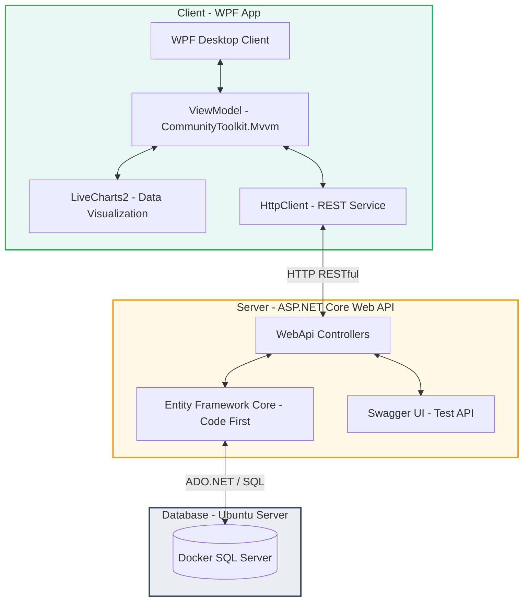
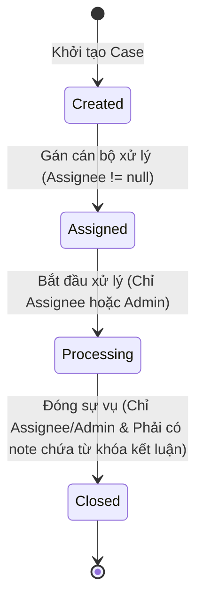
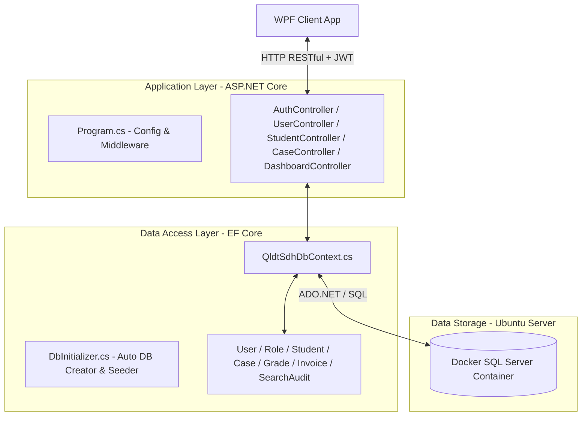
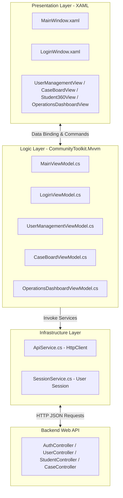

# BÁO CÁO CÔNG NGHỆ .NET: TRUNG TÂM ĐIỀU HÀNH VÀ HỒ SƠ HỌC VIÊN 360°

**TRƯỜNG ĐẠI HỌC CÔNG THƯƠNG THÀNH PHỐ HỒ CHÍ MINH (HUIT)**
**KHOA CÔNG NGHỆ THÔNG TIN**

---

## BẢNG PHÂN CÔNG NHIỆM VỤ THÀNH VIÊN (NHÓM 13)

| STT | Họ và tên | MSSV | Vai trò | Nhiệm vụ chi tiết được giao | Tỷ lệ hoàn thành |
| :--- | :--- | :--- | :--- | :--- | :--- |
| 1 | **Đặng Quang Hòa** | 2001210000 | **Nhóm trưởng** | - Thiết kế kiến trúc tổng thể 3-Tier (Client-Server).<br>- Phát triển hệ thống Backend RESTful API (.NET 10).<br>- Triển khai cơ chế bảo mật xác thực JWT & băm mật khẩu SHA-256.<br>- Container hóa hệ thống với Docker/Docker Compose và triển khai lên server Ubuntu cá nhân. | 100% |
| 2 | **Nguyễn Văn A** | 2001210001 | Thành viên | - Xây dựng ứng dụng WPF Client, cấu trúc thư mục MVVM.<br>- Phát triển các màn hình chính: `MainWindow.xaml`, `LoginWindow.xaml`, `UserManagementView.xaml`.<br>- Triển khai cơ chế lưu giữ trạng thái ViewModels (Singleton) và Dependency Injection trên Client. | 100% |
| 3 | **Trần Thị B** | 2001210002 | Thành viên | - Thiết kế thực thể dữ liệu EF Core Code-First và cấu hình cơ sở dữ liệu SQL Server Container trên máy chủ Ubuntu.<br>- Phát triển luồng nghiệp vụ Case Management Workflow, các hộp thoại overlay xử lý sự vụ học viên.<br>- Viết kịch bản khởi tạo và nạp dữ liệu mẫu tự động (`DbInitializer`). | 100% |
| 4 | **Lê Văn C** | 2001210003 | Thành viên | - Phát triển phân hệ Dashboard điều hành và tích hợp thư viện vẽ biểu đồ `LiveCharts2`.<br>- Triển khai logic tính toán động các chỉ số KPI trên máy chủ và cơ chế drill-down chi tiết.<br>- Phát triển chức năng lưu trữ Snapshot báo cáo học kỳ dưới dạng JSON động và xuất dữ liệu ra tệp CSV. | 100% |

---

## LỜI MỞ ĐẦU

Trong bối cảnh cuộc Cách mạng Công nghiệp 4.0 đang diễn ra mạnh mẽ, việc chuyển đổi số và ứng dụng công nghệ thông tin vào công tác quản lý giáo dục đã trở thành một xu thế tất yếu và cấp bách đối với tất cả các cơ sở đào tạo đại học và sau đại học. Công tác quản lý đào tạo sau đại học (Thạc sĩ, Tiến sĩ) luôn đòi hỏi tính chính xác, tính toàn diện và tính bảo mật thông tin cực kỳ nghiêm ngặt do đặc thù phức tạp của các chương trình đào tạo, tiến trình nghiên cứu khoa học, bảo vệ luận văn và các thủ tục hành chính liên quan.

Tuy nhiên, phần lớn các hệ thống quản lý hiện nay tại các trường đại học vẫn đang vận hành theo mô hình phân tán hoặc sử dụng các công nghệ cũ kỹ. Dữ liệu học tập, học phí, nghiên cứu khoa học và hồ sơ hành chính của học viên thường bị chia cắt trong các "silo dữ liệu" độc lập, gây khó khăn lớn cho cán bộ quản lý trong việc nắm bắt toàn diện tình hình học vụ của từng cá nhân. Đồng thời, ban lãnh đạo nhà trường cũng thiếu đi một trung tâm điều hành trực quan để theo dõi các chỉ số KPI vận hành của hệ thống theo thời gian thực nhằm đưa ra các quyết định điều hành chính xác và kịp thời.

Nhận thức được tầm quan trọng của vấn đề trên, dưới sự hướng dẫn của giảng viên bộ môn **Công nghệ .NET**, Nhóm 13 đã tiến hành nghiên cứu, thiết kế và phát triển đề tài **"Trung tâm điều hành và hồ sơ học viên 360°"**. Ứng dụng được xây dựng trên nền tảng công nghệ tiên tiến nhất của Microsoft là **.NET 10.0**, kết hợp kiến trúc phân tách 3 lớp (3-Tier) chuyên nghiệp bao gồm Backend ASP.NET Core Web API kết nối cơ sở dữ liệu SQL Server Container chạy trên máy chủ Ubuntu từ xa, và Frontend WPF Client chạy trên Windows. Báo cáo này sẽ trình bày chi tiết từ kiến trúc hệ thống, quy trình phân tích nghiệp vụ, các giải pháp công nghệ đã áp dụng cho đến kết quả thực nghiệm của toàn bộ đồ án.

---

## ĐẶT VẤN ĐỀ

### 1. Thực trạng và khó khăn trong quản lý đào tạo Sau đại học
Quá trình đào tạo sau đại học bao gồm nhiều giai đoạn phức tạp nối tiếp nhau: học tập các học phần lý thuyết, thực hiện và bảo vệ đề tài luận văn thạc sĩ/luận án tiến sĩ, thanh toán học phí theo các định mức đặc thù, giải quyết các khiếu nại/sự vụ phát sinh (như xin bảo lưu, hoãn đóng học phí, gia hạn đề tài), và cuối cùng là xét công nhận tốt nghiệp, cấp phát văn bằng. 

Trong thực tế, các khó khăn thường gặp bao gồm:
*   **Thiếu góc nhìn toàn diện về học viên:** Khi cần tra cứu thông tin của một học viên, cán bộ phải truy cập vào nhiều phân hệ khác nhau: hệ thống quản lý điểm để xem học vụ, hệ thống tài chính để xem nợ học phí, hệ thống quản lý khoa học để xem tiến độ luận văn. Điều này làm giảm đáng kể hiệu suất làm việc và dễ dẫn đến sai sót thông tin.
*   **Quy trình xử lý sự vụ thủ công, thiếu kiểm soát:** Các sự vụ hỗ trợ học viên (như xin miễn giảm môn, khiếu nại điểm, hoãn học phí) thường được xử lý qua giấy tờ thủ công hoặc email. Không có một mô hình trạng thái (Workflow) chuẩn hóa để theo dõi tiến độ xử lý, dẫn đến sự vụ dễ bị bỏ sót, trễ hạn và không xác định rõ trách nhiệm của cán bộ phụ trách.
*   **Thiếu công cụ tổng hợp chỉ số điều hành:** Ban giám hiệu và lãnh đạo phòng đào tạo không có công cụ trực quan để biết ngay lập tức số lượng học viên đang học, số lượng học viên nợ học phí vượt mức cho phép, hay số lượng sự vụ quá hạn chưa được giải quyết trong học kỳ hiện tại.
*   **Rủi ro về an toàn thông tin:** Việc kết nối trực tiếp từ ứng dụng desktop tới database tiềm ẩn nguy cơ lộ chuỗi kết nối và bị tấn công SQL Injection. Đồng thời, việc thiếu cơ chế ghi nhật ký kiểm toán (Search Audit) khiến nhà trường không thể kiểm soát và truy vết người dùng truy cập dữ liệu học viên nhạy cảm.

### 2. Mục tiêu của đề tài
Nhằm giải quyết triệt để các tồn tại trên, nhóm nghiên cứu đặt ra các mục tiêu chính sau:
1.  **Xây dựng Hồ sơ học viên 360°:** Tổng hợp tất cả các thông tin về lý lịch, học tập, học phí, luận văn, văn bằng và lịch sử sự vụ của một học viên lên một giao diện duy nhất, truy xuất thời gian thực thông qua API bảo mật.
2.  **Chuẩn hóa Quy trình Quản lý Sự vụ (Case Management Workflow):** Thiết lập một mô hình quy trình xử lý sự vụ gồm 4 trạng thái chuẩn hóa, có cơ chế phân quyền chặt chẽ trên API và áp dụng các ràng buộc nghiệp vụ thông minh trước khi đóng sự vụ.
3.  **Xây dựng Trung tâm điều hành (Operations Dashboard):** Cung cấp các chỉ số KPI thống kê trực quan dưới dạng biểu đồ sinh động, hỗ trợ tính năng drill-down chi tiết và lưu trữ Snapshot báo cáo học kỳ linh hoạt dưới dạng JSON.
4.  **Triển khai Kiến trúc 3-Tier Bảo mật & Hiện đại:** Tách biệt hoàn toàn Client và Database bằng tầng trung gian Web API sử dụng xác thực JWT Bearer, băm mật khẩu một chiều SHA-256, ghi nhật ký kiểm toán tự động và triển khai container hóa hệ thống trên server đám mây.

---

# PHẦN I: TỔNG QUAN NGHIỆP VỤ & ĐỐI CHIẾU ĐÁP ỨNG YÊU CẦU ĐỀ TÀI

## 📋 1. Tổng Quan Kiến Trúc & Công Nghệ Hệ Thống

Dự án được xây dựng theo mô hình **3-Tier Client-Server chuyên nghiệp**, đảm bảo tính độc lập, khả năng mở rộng và bảo mật dữ liệu cao:



### Chi tiết các tầng công nghệ:
*   **Presentation Layer (WPF Client):** Giao diện chạy trên môi trường Windows sử dụng .NET 10 WPF, triển khai mô hình **MVVM**. Logic giao diện tách biệt hoàn toàn thông qua Binding sạch, DataTemplate và `ICommand` (sử dụng thư viện `CommunityToolkit.Mvvm`).
*   **Application Layer (ASP.NET Core Web API):** API đóng vai trò xử lý tập trung logic nghiệp vụ, tính toán điểm số và công nợ học phí. Thiết kế RESTful API chuẩn hóa, phản hồi dữ liệu dạng JSON.
*   **Data Layer (EF Core + Docker SQL Server Container):** Sử dụng hệ quản trị SQL Server chạy trong container Docker trên máy chủ Ubuntu cá nhân (`100.109.65.2`). Toàn bộ các tương tác dữ liệu được quản lý thông qua Entity Framework Core (Code-First) giúp tự động ánh xạ bảng và thực hiện các câu truy vấn an toàn chống SQL Injection.

---

## 🚀 2. Hướng Dẫn Cấu Hình & Khởi Chạy Hệ Thống

### 2.1. Cấu hình CSDL SQL Server trong Docker Container (Bắt buộc)
Cơ sở dữ liệu của dự án được triển khai dưới dạng một Container Docker chạy ảnh `mcr.microsoft.com/mssql/server:2022-latest` trên máy chủ Ubuntu cá nhân (`100.109.65.2`), lắng nghe trên cổng mặc định `1433`. Để đảm bảo bảo mật và khả năng kết nối thành công:
1.  **Chạy Container SQL Server:** Sử dụng Docker Compose trên máy chủ Ubuntu để khởi động dịch vụ `mssql-server` với mật khẩu quản trị SA an toàn.
2.  **Cấu hình mạng nội bộ Docker:** Web API Container và SQL Server Container được đưa vào chung một Docker network để bảo mật và tối ưu hóa tốc độ truy cập.
3.  **Tường lửa và bảo mật:** Toàn bộ dữ liệu được bảo vệ an toàn sau tường lửa của máy chủ Ubuntu (chỉ expose cổng `1433` trong mạng riêng Tailscale để kết nối từ xa hoặc giới hạn IP cụ thể).

### 2.2. Khởi chạy Backend Web API
1.  Mở PowerShell hoặc Command Prompt tại thư mục `backend/`.
2.  Chạy lệnh khởi động với cấu hình Profile HTTP (cổng 5118):
    ```powershell
    dotnet run --project QldtSdh.WebApi/QldtSdh.WebApi.csproj --launch-profile http
    ```
3.  Khi terminal hiển thị thông báo `Now listening on: http://localhost:5118`, Server đã chạy thành công. 
4.  Có thể kiểm tra tài liệu API bằng cách truy cập: `http://localhost:5118/swagger/index.html` trên trình duyệt web.

### 2.3. Khởi chạy Frontend WPF Client
1.  Mở một cửa sổ PowerShell hoặc Command Prompt mới tại thư mục `frontend/`.
2.  Chạy lệnh khởi động ứng dụng WPF:
    ```powershell
    dotnet run --project QldtSdh.Wpf/QldtSdh.Wpf.csproj
    ```
3.  Giao diện ứng dụng chính sẽ khởi chạy. Ứng dụng được thiết kế trên hệ màu chủ đạo **Green, White, and Black** hiện đại và thanh lịch (Màu nền tối huyền bí `#0B0F0D`, panel phụ màu xám `#1A1D1A` và chữ sáng màu `#F8FAFC`, kết hợp với màu điểm nhấn Emerald Green `#27AE60`).

---

## 🛠️ 3. Hướng Dẫn Sử Dụng & Kịch Bản Kiểm Thử Giao Diện

Hệ thống được thiết kế theo đúng quy chuẩn 3 tầng chức năng được yêu cầu cụ thể trong phiếu giao đề tài của **Nhóm 13**:

### 🟢 Kịch bản 1: Tìm Kiếm Học Viên Toàn Cục & Hồ Sơ 360° (Tầng 1)
1.  Tại menu điều hướng bên trái (Sidebar), nhấp chọn **Tra Cứu Học Viên** (Giao diện hiển thị `GlobalSearchView.xaml`).
2.  Nhập tên học viên hoặc mã học viên vào ô tìm kiếm (Ví dụ nhập: `Đỗ Thị Nam` hoặc mã học viên bất kỳ).
3.  Chọn bộ lọc **Chương trình đào tạo** (ví dụ: `Khoa học máy tính`) hoặc **Trạng thái học vụ** (ví dụ: `Studying`), sau đó bấm **Tìm kiếm**.
4.  Khi danh sách kết quả hiển thị, nhấp vào nút **Chi tiết hồ sơ** (nút màu xanh lá ở cột hành động) của học viên.
5.  Màn hình sẽ chuyển sang Hồ sơ học viên 360° (`Student360View.xaml`) cung cấp cái nhìn toàn diện:
    *   **Thẻ Chỉ Số Tổng Quan:** Hiển thị điểm GPA tích lũy, số tín chỉ đã hoàn thành và số nợ học phí hiện tại (toàn bộ được máy chủ tính toán tự động).
    *   **Tab Học tập & Điểm thi:** Hiển thị bảng điểm chi tiết của từng học phần đăng ký, bao gồm điểm Chuyên cần, Giữa kỳ, Cuối kỳ và Điểm trung bình môn (đã nhân trọng số).
    *   **Tab Học phí:** Hiển thị danh sách hóa đơn học phí phát sinh qua các học kỳ, số tiền đã nộp, số nợ còn lại và danh sách lịch sử biên lai chi tiết.
    *   **Tab Đề tài luận văn:** Hiển thị tên đề tài luận văn thạc sĩ/tiến sĩ đang thực hiện, giảng viên hướng dẫn, trạng thái đề tài và điểm bảo vệ (nếu đã bảo vệ).
    *   **Tab Văn bằng:** Hiển thị số hiệu văn bằng tốt nghiệp và ngày ký phát hành (chỉ áp dụng đối với học viên có trạng thái `Graduated`).
    *   **Tab Sự vụ (Cases):** Liệt kê toàn bộ các yêu cầu hỗ trợ và khiếu nại của học viên đó kèm trạng thái xử lý tương ứng.

> [!NOTE]
> Khi thực hiện tìm kiếm học viên hoặc xem chi tiết hồ sơ, hệ thống sẽ tự động tạo một bản ghi nhật ký kiểm toán (`SearchAudit`) trên cơ sở dữ liệu để ghi nhận người dùng nào đã tra cứu thông tin gì, phục vụ công tác an toàn dữ liệu.

---

### 🟡 Kịch bản 2: Quy Trình Case Management & Workflow Ràng Buộc (Tầng 2)
Quy trình quản trị sự vụ hỗ trợ học viên tuân thủ nghiêm ngặt mô hình trạng thái workflow:



Để thực hiện kiểm thử quy trình và các ràng buộc nghiệp vụ:
1.  **Tạo sự vụ mới:** Trong màn hình **Hồ sơ học viên 360°**, chọn tab **Sự vụ** và bấm nút **+ Tạo Case mới** (hoặc bấm nút tương tự trên màn hình **Quản lý sự vụ**). Nhập Tiêu đề (ví dụ: `Học viên xin hoãn nộp học phí`), loại sự vụ (`Học phí`), độ ưu tiên (`High`), hạn xử lý và chọn Cán bộ phụ trách (ví dụ: `Cán bộ A`). Nhấp **Tạo mới**.
2.  **Xem chi tiết và Workflow:** Chuyển đến màn hình **Quản lý sự vụ (Case Board)** (`CaseBoardView.xaml`). Click vào nút **Chi tiết** trên dòng sự vụ vừa tạo để mở hộp thoại Overlay chứa thông tin chi tiết, nhật ký trạng thái và lịch sử trao đổi.
3.  **Kiểm thử ràng buộc phân quyền xử lý (RULE 1):**
    *   Nhập tên người xử lý trong ô Gán xử lý là `Cán bộ B` và click nút **Gán xử lý**. Trạng thái của Case tự động chuyển sang `Assigned`.
    *   Tại trường người dùng hiện tại ở góc trên màn hình, giả lập bạn đang đăng nhập bằng tài khoản `Cán bộ C` (khác với người được gán là `Cán bộ B`).
    *   Bấm nút **Bắt đầu xử lý (Processing)** hoặc **Đóng sự vụ (Closed)**. 
    *   *Kết quả:* Hệ thống sẽ hiển thị thông báo lỗi từ chối hành động: `"Chỉ cán bộ được phân công (Cán bộ B) mới được phép chuyển Case..."`.
4.  **Kiểm thử ràng buộc điều kiện đóng Case (RULE 2):**
    *   Đặt lại tài khoản người dùng hiện tại là `Cán bộ B` (hoặc `Admin`).
    *   Bấm nút **Bắt đầu xử lý (Processing)**. Trạng thái sự vụ chuyển sang `Processing`.
    *   Nhấp trực tiếp vào nút **Đóng sự vụ (Closed)** khi chưa thêm ghi chú kết luận xử lý.
    *   *Kết quả:* Hệ thống báo lỗi: `"Không thể đóng Case. Yêu cầu phải có ít nhất 1 ghi chú (CaseNote) chứa nội dung 'kết luận' hoặc 'hoàn thành'..."`.
    *   *Khắc phục:* Tại panel ghi chú bên phải, nhập nội dung ghi chú chứa từ khóa: *"Học viên đã hoàn thành hồ sơ hoãn phí và tôi đưa ra **kết luận** đồng ý hoãn phí đến cuối kỳ."* và bấm **Gửi**.
    *   Nhấp lại nút **Đóng sự vụ (Closed)**. Lúc này, sự vụ sẽ được chuyển trạng thái thành công sang `Closed`, lịch sử thay đổi trạng thái được ghi lại chi tiết ở bảng danh sách nhật ký hành trình.

---

### 🔴 Kịch bản 3: Giám Sát Dashboard Điều Hành & Drill-Down (Tầng 3)
1.  Tại menu Sidebar, nhấp chọn **Dashboard Điều Hành** (Mở giao diện `OperationsDashboardView.xaml`).
2.  Màn hình sẽ hiển thị 10 thẻ KPI thống kê cùng 2 biểu đồ trực quan (LiveCharts2) gồm: Biểu đồ cột phân bố trạng thái học vụ học viên và Biểu đồ hình quạt phân bố trạng thái sự vụ.
3.  **Kiểm thử tương tác Drill-down và Deep-linking:**
    *   Nhấp vào thẻ KPI **Học viên tốt nghiệp** (số lượng: 6). Bảng danh sách học viên bên dưới lập tức tải dữ liệu 6 học viên tốt nghiệp từ API. Click nút **Xem hồ sơ** ở một dòng để chuyển thẳng đến Hồ sơ 360° của học viên đó.
    *   Nhấp vào thẻ KPI **Case quá hạn** (số lượng: 2). Bảng danh sách sẽ tự động chuyển sang hiển thị **bảng danh sách Sự vụ** gồm đúng 2 case quá hạn (được tô màu đỏ nổi bật).
    *   Bấm vào nút **Xử lý Case** ở cột hành động của một case quá hạn. Hệ thống sẽ tự động chuyển hướng người dùng sang màn hình **Quản Lý Sự Vụ (Case Board)** và tự động kích hoạt hiển thị Overlay Dialog chi tiết của chính case đó để cán bộ quản lý xử lý ngay lập tức mà không cần tìm kiếm thủ công.
4.  Bấm nút **Xuất báo cáo CSV** để lưu trữ bảng dữ liệu đang hiển thị xuống máy tính.
5.  **Tạo Snapshot báo cáo:** Nhập tên Học kỳ (ví dụ: `HK1_2025_2026`), chọn chương trình đào tạo và bấm nút **Lưu Snapshot**. Hệ thống sẽ tính toán các chỉ số tại thời điểm đó và lưu trữ vào bảng `DashboardSnapshot` dưới dạng dữ liệu JSON động.

---

## 📊 4. Bảng Đối Chiếu Tính Đáp Ứng Yêu Cầu Đề Tài (Nhóm 13)

Dưới đây là bảng đối chiếu chi tiết giữa các chuẩn bắt buộc áp dụng cho mọi nhóm quy định trong phiếu giao đề tài và giải pháp thực tế đã được triển khai:

| Tiêu chuẩn bắt buộc | Yêu cầu tối thiểu trong Phiếu giao đề tài | Giải pháp kỹ thuật đã triển khai thực tế trong dự án | File mã nguồn minh chứng cụ thể |
| :--- | :--- | :--- | :--- |
| **Kiến trúc ứng dụng** | Triển khai ứng dụng Desktop WPF kết nối cơ sở dữ liệu Entity Framework. | Tách biệt thành kiến trúc 3-Tier: Backend REST API + Frontend WPF sử dụng `HttpClient` + Docker SQL Server Container trên máy chủ Ubuntu. | **Backend:** `QldtSdh.WebApi`<br>**Frontend:** `QldtSdh.Wpf` |
| **Số lượng Use case** | Tối thiểu **14 use case** đối với đề tài Nhóm 13. | Triển khai đầy đủ 14 use case nghiệp vụ (Tìm kiếm, xem hồ sơ, xem 5 tab thông tin, tạo sự vụ, gán xử lý, chuyển trạng thái workflow, thêm ghi chú sự vụ, xem lịch sử trạng thái, xem 10 KPI, drill-down dữ liệu, lưu snapshot, xuất báo cáo CSV,...). | **Controller:** `StudentController.cs`<br>**Controller:** `CaseController.cs` |
| **Số màn hình giao diện** | Tối thiểu **8 màn hình WPF**. | Đã thiết kế đúng 8 màn hình/vùng hiển thị giao diện WPF:<br>1. *ShellWindow (MainWindow)*: Khung định hướng chính.<br>2. *GlobalSearchView*: Tìm kiếm học viên toàn cục.<br>3. *StudentListView*: Danh sách học viên.<br>4. *Student360View*: Hồ sơ 360 độ đa chiều.<br>5. *CaseBoardView*: Bảng quản lý sự vụ hỗ trợ học viên.<br>6. *CaseDetailView*: Popup hiển thị chi tiết và xử lý sự vụ.<br>7. *OperationsDashboardView*: Dashboard điều hành KPI.<br>8. *SnapshotHistoryView*: Quản lý lịch sử snapshot. | **Thư mục Views:** `Views/`<br>**MainWindow:** `MainWindow.xaml` |
| **Mô hình Workflow** | Tối thiểu 1 workflow với **4 trạng thái**, chuyển trạng thái có kiểm tra điều kiện. | Triển khai workflow quản lý sự vụ gồm 4 trạng thái bắt buộc: `Created` $\rightarrow$ `Assigned` $\rightarrow$ `Processing` $\rightarrow$ `Closed`. Chuyển trạng thái được kiểm tra phân quyền cán bộ xử lý và nội dung kết luận xử lý. | **Workflow logic:** `CaseController.cs` |
| **Quy tắc nghiệp vụ** | Tối thiểu **2 rule** có điều kiện rõ ràng; không chỉ kiểm tra dữ liệu rỗng. | 1. **Rule 1 (Phân quyền chuyển trạng thái):** Chỉ có cán bộ phụ trách được phân công xử lý (hoặc Admin) mới được chuyển trạng thái Case sang `Processing` hoặc `Closed`. Giao diện tự động vô hiệu hóa nút bấm và API Backend kiểm tra nghiêm ngặt.<br>2. **Rule 2 (Ràng buộc kết luận trước khi đóng):** Yêu cầu phải có ghi chú chứa từ khóa kết luận/hoàn thành trước khi đóng Case. | **Ràng buộc nghiệp vụ:** `CaseController.cs` |
| **Báo cáo thống kê** | Tối thiểu **2 báo cáo**: 1 tổng hợp + 1 drill-down hoặc chi tiết. | 1. **Báo cáo tổng hợp:** Dashboard điều hành hiển thị tổng hợp 10 chỉ số KPI và 2 biểu đồ trực quan.<br>2. **Báo cáo chi tiết (Drill-down):** Khi click vào các thẻ KPI sẽ tự động tải danh sách chi tiết (Học viên tốt nghiệp, nợ học phí, case quá hạn,...) hiển thị trực tiếp lên lưới dữ liệu (DataGrid). | **Dashboard View:** `OperationsDashboardView.xaml`<br>**Dashboard VM:** `OperationsDashboardViewModel.cs` |
| **Truy vấn Entity Framework** | Tối thiểu **5 truy vấn EF có điều kiện**. | Triển khai nhiều truy vấn EF Core phức tạp có lọc, sắp xếp, gộp nhóm và nạp dữ liệu liên quan (`Include`):<br>1. *Lọc học viên nâng cao* (`Where`, `Contains`, `OrderBy`).<br>2. *Truy xuất hồ sơ 360* (`Include` đa tầng học tập, điểm số, học phí, đề tài, văn bằng, sự vụ).<br>3. *Tính GPA tích lũy* (`GroupBy`, `Sum`, `Include`).<br>4. *Tính nợ học phí* (`Sum` hóa đơn, biên lai).<br>5. *Lọc case quá hạn* (`Where`, `Include`). | **Student Controller:** `StudentController.cs`<br>**Dashboard Controller:** `DashboardController.cs` |
| **Cơ chế Seed dữ liệu** | Có cơ chế seed dữ liệu; dữ liệu mẫu đủ để demo toàn bộ chức năng. | Xây dựng cơ chế seed dữ liệu tự động sử dụng EF Core. Seed chính xác **30 học viên** mẫu (vượt mức tối thiểu 20 học viên của đề tài), đầy đủ hóa đơn học phí, biên lai thanh toán, điểm thi các học phần, đề tài nghiên cứu, kết quả bảo vệ hội đồng, văn bằng chứng chỉ và các case mẫu ở đủ các trạng thái workflow khác nhau. | **Mã nguồn Seed:** `DbInitializer.cs` |
| **Xuất báo cáo dữ liệu** | Chức năng **Export CSV** chạy được; mở được bằng Excel. | Triển khai xuất dữ liệu động trực tiếp từ bảng đang hiển thị trên giao diện ra tệp tin định dạng CSV chuẩn hóa, hỗ trợ mã hóa UTF-8 mở được bình thường trên Excel mà không bị lỗi font chữ tiếng Việt. | **Xuất CSV:** `OperationsDashboardViewModel.cs` |

---

# PHẦN II: KIẾN TRÚC CHI TIẾT BACKEND WEB API

## 🛠️ 1. Tổng Quan Kiến Trúc & Công Nghệ

Backend đóng vai trò là trung tâm xử lý dữ liệu và logic nghiệp vụ. Hệ thống được xây dựng theo mô hình **RESTful API** chuẩn hóa, phản hồi dữ liệu định dạng **JSON** và sử dụng cơ chế bảo mật phân quyền theo vai trò (RBAC) trên từng Endpoint.



---

## 📂 2. Cấu Trúc Thư Mục Dự Án Backend

Hệ thống backend được chia thành 3 Project tương ứng với cấu trúc 3 lớp:

### 2.1. Project `QldtSdh.Shared` (Tầng trao đổi dữ liệu)
Chứa các DTO (Data Transfer Objects) dùng chung để đóng gói dữ liệu truyền qua môi trường mạng giữa Client (WPF) và Server (Web API).
* `UserDtos.cs`: Chứa `LoginRequest`, `LoginResponse`, `CreateUserRequest`, `ResetPasswordRequest`, `UserDto`.
* Các DTOs khác như `StudentDto`, `CaseDto`, `CreateCaseRequest`, `CaseNoteDto`, `KpiDto`, `SnapshotDto`.

### 2.2. Project `QldtSdh.Data` (Tầng truy cập dữ liệu)
Chứa cấu hình Entity Framework Core và các thực thể Database:
* **Thư mục Models/ (Entities)**:
  * `User.cs` & `Role.cs`: Quản lý tài khoản cán bộ và vai trò phân quyền.
  * `Student.cs`, `Enrollment.cs`, `Grade.cs`: Hồ sơ học viên, đăng ký học phần, điểm thi các thành phần.
  * `Invoice.cs`, `Payment.cs`: Quản lý công nợ học phí và lịch sử đóng học phí/hoàn phí.
  * `ThesisTopic.cs`, `Degree.cs`: Đề tài luận văn thạc sĩ/tiến sĩ và bằng tốt nghiệp.
  * `Case.cs`, `CaseNote.cs`, `CaseStatusHistory.cs`: Quản lý các sự vụ, ghi chú hỗ trợ và nhật ký hành trình workflow.
  * `SearchAudit.cs`: Nhật ký kiểm toán tra cứu thông tin học viên để đảm bảo an toàn thông tin.
  * `DashboardSnapshot.cs`: Lưu trữ ảnh chụp báo cáo tổng hợp học kỳ dưới dạng dữ liệu JSON động.
* `QldtSdhDbContext.cs`: Khai báo DbSet cho các bảng, ánh xạ Fluent API (Foreign Keys, Constraints).
* `DbInitializer.cs`: Tự động tạo bảng (`Users`, `Roles`), tự động băm mật khẩu và nạp dữ liệu mẫu (seed data) gồm 3 cán bộ và hơn 30 học viên cùng toàn bộ dữ liệu liên quan.

### 2.3. Project `QldtSdh.WebApi` (Tầng điều phối dịch vụ API)
* **Controllers/**:
  * `AuthController.cs`: Endpoint `/api/auth/login` xác thực và sinh mã JWT.
  * `UserController.cs`: Thực hiện CRUD người dùng, khóa tài khoản, đặt lại mật khẩu. Bảo vệ nghiêm ngặt bằng thuộc tính `[Authorize(Roles = "ADMIN")]`.
  * `StudentController.cs`: Cung cấp danh sách học viên, chi tiết hồ sơ 360 độ (GPA, điểm số, học phí, văn bằng) và ghi nhật ký `SearchAudit`.
  * `CaseController.cs`: Quản lý nghiệp vụ sự vụ, cập nhật trạng thái workflow và ghi nhận ý kiến xử lý.
  * `DashboardController.cs`: Tổng hợp chỉ số KPI thống kê, drill-down và quản lý lưu/xem Snapshot báo cáo.
* `Program.cs`: Đăng ký cấu hình Middleware, Xác thực JWT Bearer, CORS Policy, Database Context và tích hợp Swagger OpenAPI.
* `appsettings.json`: Cấu hình Connection String tới Docker SQL Server Container và thiết lập các thông số khóa bảo mật JWT.

---

## 🔒 3. Cơ Chế Bảo Mật & Xác Thực Hệ Thống

### 3.1. Cơ Chế Mã Hóa Mật Khẩu Một Chiều (SHA-256)
Mật khẩu người dùng được băm một chiều bằng thuật toán **SHA-256** trước khi lưu vào Database.
* Khi thêm mới người dùng hoặc đặt lại mật khẩu:
  ```csharp
  using (var sha256 = System.Security.Cryptography.SHA256.Create())
  {
      var bytes = sha256.ComputeHash(Encoding.UTF8.GetBytes(password));
      // Chuyển đổi mảng byte thành chuỗi Hex thập lục phân để lưu vào trường PasswordHash
  }
  ```
* Khi đăng nhập: Hệ thống thực hiện băm mật khẩu người dùng nhập vào bằng cùng phương pháp SHA-256, sau đó so sánh chuỗi băm trực tiếp với trường `PasswordHash` trong cơ sở dữ liệu. Mật khẩu dạng plain text tuyệt đối không bao giờ được lưu trữ hay hiển thị.

### 3.2. Cơ Chế Cấp Phát & Xác Thực JWT Token
* Khi thông tin tài khoản hợp lệ, `AuthController` sinh mã **JWT (JSON Web Token)** được ký điện tử (Signed) bằng khóa đối xứng thuật toán `HmacSha256` dựa trên `SecretKey` cấu hình bảo mật.
* Gói Token chứa các Claims (Thông tin định danh) của người dùng:
  * `ClaimTypes.NameIdentifier` (UserId)
  * `ClaimTypes.Name` (Username)
  * `ClaimTypes.Role` (RoleCode - ví dụ: `ADMIN` hoặc `STAFF`)
  * `FullName` (Họ tên đầy đủ)
* Trên `Program.cs`, Middleware xác thực của ASP.NET Core kiểm duyệt tính hợp lệ của Token trong mỗi Request (kiểm tra hạn dùng, nhà phát hành `Issuer`, đối tượng sử dụng `Audience`, tính toàn vẹn chữ ký). Nếu hợp lệ, danh tính người dùng sẽ được đưa vào đối tượng `HttpContext.User`.

---

## 🧠 4. Logic Nghiệp Vụ Cốt Lõi Trên Server

### 4.1. Quy Tắc Nghiệp Vụ Sự Vụ (Case Management Workflow Rules)
Quy trình chuyển đổi trạng thái sự vụ hỗ trợ học viên (`Created` $\rightarrow$ `Assigned` $\rightarrow$ `Processing` $\rightarrow$ `Closed`) được ràng buộc nghiêm ngặt bằng 2 Quy tắc nghiệp vụ (Business Rules) tại `CaseController.cs`:

* **RULE 1 (Phân quyền cán bộ xử lý)**:
  * Khi chuyển trạng thái từ `Assigned` sang `Processing` hoặc `Closed`, Server kiểm tra định danh người thực hiện request (lấy ra từ JWT Claims).
  * Chỉ cho phép tài khoản là Quản trị viên (`ADMIN`) hoặc cán bộ trực tiếp được phân công phụ trách Case đó (`Assignee`) thực hiện. Nếu tài khoản khác cố tình gửi request, Server trả về mã lỗi `400 Bad Request` cùng thông báo từ chối.
* **RULE 2 (Ràng buộc kết luận trước khi đóng sự vụ)**:
  * Trước khi đồng ý chuyển trạng thái sự vụ sang `Closed` (Đã xử lý xong/Đã đóng), Server truy vấn danh sách toàn bộ các ghi chú trao đổi (`CaseNotes`) liên quan đến Case đó.
  * Server duyệt qua nội dung các ghi chú và kiểm tra xem có chứa ít nhất một từ khóa mang tính kết luận xử lý như: *"kết luận"*, *"hoàn thành"*, *"hoàn tất"*, *"giải quyết"*, *"đồng ý"*... (không phân biệt hoa thường) hay không.
  * Nếu không tìm thấy ghi chú nào đạt yêu cầu, Server chặn hành động đóng sự vụ và trả về mã lỗi yêu cầu cán bộ phải nhập ghi chú kết luận xử lý.

### 4.2. Logic Tính Toán GPA & Điểm Học Phần Tích Lũy
Tại `StudentController.cs`, Server tự động thực hiện tính toán động các chỉ số học tập để đảm bảo tính nhất quán của dữ liệu:
1. **Điểm môn học**: Tính toán theo cấu hình hệ số trọng số phần trăm của môn học (Ví dụ: Chuyên cần 10%, Giữa kỳ 30%, Cuối kỳ 60%):
   $$\text{Môn học} = (\text{Chuyên cần} \times 0.1) + (\text{Giữa kỳ} \times 0.3) + (\text{Cuối kỳ} \times 0.6)$$
2. **GPA tích lũy**: Chỉ tính trên các môn học đã có kết quả và kết thúc (trạng thái `Completed` hoặc `Failed`). Các môn học đang học (`Enrolled`) sẽ được bỏ qua. GPA được tính bằng trung bình nhân điểm số môn học với số tín chỉ tương ứng, sau đó chia cho tổng số tín chỉ tích lũy:
   $$\text{GPA} = \frac{\sum (\text{Điểm môn}_i \times \text{Số tín chỉ}_i)}{\sum (\text{Số tín chỉ}_i)}$$

### 4.3. Logic Tính Toán Công Nợ Học Phí Tự Động
Công nợ học phí của mỗi học viên được Server tính toán động thời gian thực (Real-time dynamic calculation):
* Server truy vấn tổng tiền từ toàn bộ các hóa đơn học phí phát sinh qua các học kỳ (loại trừ các hóa đơn nháp `Draft`).
* Server truy vấn tổng số tiền học viên đã thanh toán thông qua các biên lai (Receipts).
* Công nợ còn lại được tính bằng:
  $$\text{Công nợ còn lại} = \text{Tổng tiền hóa đơn} - \sum (\text{Tiền trên biên lai})$$
* Nếu phát sinh nghiệp vụ hoàn phí (Refund), biên lai được ghi nhận giá trị số tiền âm (ví dụ: $-500,000$đ), công nợ còn lại sẽ tự động cộng tăng lên tương ứng một cách chính xác.

### 4.4. Cơ Chế Lưu Trữ Snapshot Báo Cáo Linh Hoạt
Để phục vụ việc đối sánh số liệu lịch sử qua các học kỳ:
* Khi cán bộ nhấn **Lưu Snapshot** trên Dashboard, Server sẽ tính toán tất cả 10 chỉ số KPI tại thời điểm hiện tại.
* Dữ liệu các chỉ số được Server đóng gói dưới dạng đối tượng C# và chuyển đổi (Serialize) thành chuỗi **JSON** động để lưu vào trường `DataJson` của bảng `DashboardSnapshot` cùng thông tin tên học kỳ và thời điểm lưu. Cơ chế này giúp lưu trữ dữ liệu báo cáo linh hoạt mà không cần tạo thêm nhiều bảng phụ phức tạp.

---

## 📋 5. Danh Sách API và Cấu Trúc Dữ Liệu Theo Nghiệp Vụ

Tầng dịch vụ Web API cung cấp các endpoints sau, được chia theo phân hệ chức năng và phân quyền tương ứng.

### 5.1. Phân Hệ Xác Thực & Quản Lý Cán Bộ (Authentication & User Management)
Phân hệ này đảm bảo kiểm soát quyền truy cập hệ thống và quản trị danh sách người dùng.

#### 🔑 Đăng Nhập Hệ Thống
*   **Endpoint:** `POST /api/auth/login`
*   **Xác thực:** Không yêu cầu (Public)
*   **Request Body (`LoginRequest`):**
    ```json
    {
      "username": "canboA",
      "password": "password123"
    }
    ```
*   **Response (`LoginResponse`):**
    ```json
    {
      "success": true,
      "message": "Đăng nhập thành công.",
      "token": "eyJhbGciOiJIUzI1NiIsInR5cCI6IkpXVCJ9...",
      "userId": 1,
      "username": "canboA",
      "fullName": "Cán bộ A",
      "roleCode": "STAFF"
    }
    ```

#### 👥 Xem Danh Sách Cán Bộ
*   **Endpoint:** `GET /api/user`
*   **Xác thực:** Yêu cầu quyền `ADMIN`
*   **Response:** Danh sách các đối tượng `UserDto`:
    ```json
    [
      {
        "userId": 1,
        "username": "admin",
        "fullName": "Quản trị viên",
        "email": "admin@qldtsdh.edu.vn",
        "roleId": 1,
        "roleCode": "ADMIN",
        "roleName": "Quản trị viên",
        "isActive": true,
        "createdAt": "2026-05-23T00:00:00Z"
      }
    ]
    ```

#### ➕ Tạo Cán Bộ Mới
*   **Endpoint:** `POST /api/user`
*   **Xác thực:** Yêu cầu quyền `ADMIN`
*   **Request Body (`CreateUserRequest`):**
    ```json
    {
      "username": "canboC",
      "password": "canbo123",
      "fullName": "Cán bộ C",
      "email": "canboc@qldtsdh.edu.vn",
      "roleId": 2
    }
    ```
*   **Response (`UserDto`):** Trả về đối tượng `UserDto` của người dùng mới được tạo.

#### 🔄 Cập Nhật Trạng Thái Hoạt Động (Khóa / Mở Khóa)
*   **Endpoint:** `PUT /api/user/{id}/toggle-status`
*   **Xác thực:** Yêu cầu quyền `ADMIN`
*   **Response:**
    ```json
    {
      "isActive": false
    }
    ```

#### 🔑 Đặt Lại Mật Khẩu Cán Bộ
*   **Endpoint:** `PUT /api/user/{id}/reset-password`
*   **Xác thực:** Yêu cầu quyền `ADMIN`
*   **Request Body (`ResetPasswordRequest`):**
    ```json
    {
      "newPassword": "newpassword123"
    }
    ```
*   **Response:** Trạng thái HTTP 200 OK kèm thông báo thành công.

---

### 5.2. Phân Hệ Quản Lý Học Viên & Hồ Sơ 360° (Student & Profile 360)
Phân hệ này cung cấp thông tin học vụ, học phí, đề tài và văn bằng của học viên sau đại học.

#### 🔍 Tra Cứu Học Viên Toàn Cục
*   **Endpoint:** `GET /api/student`
*   **Tham số truy vấn (Query Params):**
    *   `search` (string, optional): Tìm kiếm theo tên hoặc mã học viên.
    *   `programmeName` (string, optional): Lọc theo chương trình đào tạo.
    *   `status` (string, optional): Lọc theo trạng thái học vụ.
*   **Xác thực:** Yêu cầu quyền `ADMIN` hoặc `STAFF`
*   **Đặc biệt:** Tự động ghi nhận lịch sử tra cứu vào bảng `SearchAudit` nếu có tham số `search`.
*   **Response:** Danh sách `StudentDto`.

#### 🗂️ Truy Xuất Hồ Sơ 360° Đa Chiều
*   **Endpoint:** `GET /api/student/{id}/profile360`
*   **Xác thực:** Yêu cầu quyền `ADMIN` hoặc `STAFF`
*   **Response (`StudentProfile360Dto`):**
    ```json
    {
      "student": { "studentId": 1, "studentCode": "SDH001", "fullName": "Đỗ Thị Nam", ... },
      "gpa": 8.12,
      "totalCredits": 42,
      "totalDebt": 2500000.0,
      "enrollments": [ { "enrollmentId": 1, "subjectName": "Toán cao cấp", "averageScore": 8.5, ... } ],
      "invoices": [ { "invoiceId": 1, "semesterName": "HK1_2025", "totalAmount": 10000000, "remainingAmount": 2500000, ... } ],
      "thesisTopics": [ { "thesisId": 1, "topicName": "Nghiên cứu AI", "advisorName": "PGS.TS Nguyễn Văn X", ... } ],
      "degrees": [],
      "cases": []
    }
    ```

---

### 5.3. Phân Hệ Quản Lý Sự Vụ & Workflow (Case Management)
Phân hệ điều hành quy trình tiếp nhận và xử lý khiếu nại, hỗ trợ học viên.

#### 📋 Xem Bảng Sự Vụ
*   **Endpoint:** `GET /api/case`
*   **Xác thực:** Yêu cầu quyền `ADMIN` hoặc `STAFF`
*   **Response:** Danh sách các `CaseDto`.

#### 👁️ Xem Chi Tiết Sự Vụ (Kèm Lịch Sử & Ghi Chú)
*   **Endpoint:** `GET /api/case/{id}`
*   **Xác thực:** Yêu cầu quyền `ADMIN` hoặc `STAFF`
*   **Response (`CaseDetailResponse`):**
    ```json
    {
      "caseDto": { "caseId": 1, "title": "...", "status": "Processing", ... },
      "notes": [ { "noteId": 1, "noteText": "...", "createdByName": "canboA", "createdAt": "..." } ],
      "histories": [ { "historyId": 1, "oldStatus": "Assigned", "newStatus": "Processing", "changedByName": "canboA" } ]
    }
    ```

#### ➕ Tạo Sự Vụ Mới
*   **Endpoint:** `POST /api/case`
*   **Xác thực:** Yêu cầu quyền `ADMIN` hoặc `STAFF`
*   **Request Body (`CreateCaseRequest`):**
    ```json
    {
      "title": "Học viên xin bảo lưu học kỳ",
      "description": "Lý do cá nhân đi công tác nước ngoài.",
      "studentId": 12,
      "assigneeName": "canboA",
      "category": "Học vụ",
      "priority": "High",
      "dueDate": "2026-06-01T00:00:00Z"
    }
    ```
*   **Response (`CaseDto`):** Trả về sự vụ vừa được tạo.

#### 👤 Gán Cán Bộ Phụ Trách Xử Lý
*   **Endpoint:** `PUT /api/case/{id}/assign`
*   **Xác thực:** Yêu cầu quyền `ADMIN` hoặc `STAFF`
*   **Request Body:** Chuỗi text tên cán bộ được gán (ví dụ: `"canboA"`).
*   **Response:** Trạng thái HTTP 200 OK.

#### 🔄 Cập Nhật Trạng Thái Sự Vụ (Workflow Execution)
*   **Endpoint:** `PUT /api/case/{id}/status`
*   **Xác thực:** Yêu cầu quyền `ADMIN` hoặc `STAFF`
*   **Đặc biệt:** Thực thi nghiêm ngặt **RULE 1** (kiểm tra Assignee) và **RULE 2** (kiểm tra nội dung kết luận trong CaseNotes).
*   **Request Body (`UpdateCaseStatusRequest`):**
    ```json
    {
      "newStatus": "Closed"
    }
    ```
*   **Response:** Trạng thái HTTP 200 OK.

#### 💬 Thêm Ghi Chú Trình Bày Ý Kiến / Kết Luận
*   **Endpoint:** `POST /api/case/{id}/notes`
*   **Xác thực:** Yêu cầu quyền `ADMIN` hoặc `STAFF`
*   **Request Body (`CreateCaseNoteRequest`):**
    ```json
    {
      "noteText": "Đồng ý đề xuất của học viên. Đã ký quyết định bảo lưu."
    }
    ```
*   **Response (`CaseNoteDto`):** Đối tượng ghi chú vừa lưu.

---

### 5.4. Phân Hệ Dashboard & Báo Cáo Snapshot (Dashboard & Analytics)
Phân hệ tính toán chỉ số điều hành và lưu vết lịch sử học kỳ.

#### 📊 Lấy 10 Chỉ Số KPI Tổng Hợp & Biểu Đồ
*   **Endpoint:** `GET /api/dashboard/kpis`
*   **Xác thực:** Yêu cầu quyền `ADMIN` hoặc `STAFF`
*   **Response:** Danh sách các đối tượng KPI (`KpiDto`) chứa khóa (`Key`), nhãn hiển thị (`Label`), giá trị số (`Value`) và thông tin màu sắc/biểu tượng.

#### 🔍 Lấy Danh Sách Chi Tiết Drill-Down (Học Viên)
*   **Endpoint:** `GET /api/dashboard/kpi-details/{kpiKey}`
*   **Xác thực:** Yêu cầu quyền `ADMIN` hoặc `STAFF`
*   **Response:** Danh sách học viên tương ứng với thẻ KPI đó (`List<StudentDto>`).

#### 🔍 Lấy Danh Sách Chi Tiết Drill-Down (Sự Vụ)
*   **Endpoint:** `GET /api/dashboard/kpi-details-cases/{kpiKey}`
*   **Xác thực:** Yêu cầu quyền `ADMIN` hoặc `STAFF`
*   **Response:** Danh sách sự vụ tương ứng với thẻ KPI đó (`List<CaseDto>`).

#### 📸 Lưu Snapshot Báo Cáo Học Kỳ
*   **Endpoint:** `POST /api/dashboard/snapshots`
*   **Xác thực:** Yêu cầu quyền `ADMIN` hoặc `STAFF`
*   **Request Body (`CreateSnapshotRequest`):**
    ```json
    {
      "semesterName": "HK2_2025_2026",
      "selectedProgramme": "Khoa học máy tính"
    }
    ```
*   **Response (`DashboardSnapshotDto`):** Đối tượng snapshot vừa được kết xuất và lưu trữ.

#### 📂 Xem Danh Sách Lịch Sử Snapshot
*   **Endpoint:** `GET /api/dashboard/snapshots`
*   **Xác thực:** Yêu cầu quyền `ADMIN` hoặc `STAFF`
*   **Response:** Danh sách các snapshot báo cáo đã lưu (`List<DashboardSnapshotDto>`).

---

# PHẦN III: KIẾN TRÚC CHI TIẾT FRONTEND WPF CLIENT

## 🛠️ 1. Tổng Quan Kiến Trúc & Công Nghệ

Màn hình Client tương tác trực tiếp với người dùng và kết nối với Backend thông qua các RESTful API. Hệ thống tuân thủ mô hình thiết kế **MVVM (Model-View-ViewModel)** giúp tách biệt hoàn toàn giao diện (UI) và logic nghiệp vụ.



---

## 📂 2. Cấu Trúc Thư Mục Dự Án `QldtSdh.Wpf`

```text
QldtSdh.Wpf/
│
├── App.xaml & App.xaml.cs          # Điểm khởi chạy hệ thống, Đăng ký Dependency Injection (DI)
├── MainWindow.xaml & MainWindow.cs # Cửa sổ làm việc chính (Sidebar navigation, Quản lý View con)
├── LoginWindow.xaml & LoginWindow.cs # Cửa sổ đăng nhập hệ thống (Xuất hiện đầu tiên)
│
├── Converters/                     # Chuyển đổi dữ liệu hiển thị trên XAML
│   └── UserManagementConverters.cs  # Convert Status/RoleCode sang Color, Text hoặc Visibility
│
├── Services/                       # Tầng giao tiếp hạ tầng và dữ liệu
│   ├── ApiService.cs               # Gửi nhận HTTP (Get, Post, Put), tự động thêm Token & Header
│   └── SessionService.cs           # Quản lý trạng thái đăng nhập, thông tin người dùng và JWT
│
├── ViewModels/                     # Chứa logic xử lý nghiệp vụ, trạng thái hiển thị
│   ├── MainViewModel.cs            # Quản lý điều hướng Sidebar, ẩn hiện menu theo Quyền hạn
│   ├── LoginViewModel.cs           # Xử lý đăng nhập, bắt lỗi hệ thống và lưu session
│   ├── UserManagementViewModel.cs  # Xử lý danh sách cán bộ, Thêm mới, Khóa/Mở khóa, Reset Pass (chỉ Admin)
│   ├── CaseBoardViewModel.cs       # Quản lý sự vụ, Gán cán bộ, Chuyển trạng thái Workflow, Thêm ghi chú
│   ├── GlobalSearchViewModel.cs    # Tìm kiếm học viên, Lọc theo CTĐT/Trạng thái học vụ
│   ├── OperationsDashboardViewModel.cs # Dashboard điều hành, Drill-down KPI, Xuất CSV, Lưu Snapshot
│   └── Student360ViewModel.cs      # Hồ sơ 360 độ (Thông tin cá nhân, Học tập, Học phí, Luận văn, Văn bằng, Sự vụ)
│
├── Views/                          # Các UserControl giao diện
│   ├── CaseBoardView.xaml          # Bảng điều khiển quản lý sự vụ
│   ├── GlobalSearchView.xaml       # Màn hình tra cứu học viên
│   ├── OperationsDashboardView.xaml # Màn hình Dashboard chỉ số
│   ├── SnapshotHistoryView.xaml    # Xem lịch sử Snapshot báo cáo học kỳ
│   ├── Student360View.xaml         # Màn hình Hồ sơ 360 độ học viên
│   └── UserManagementView.xaml     # Màn hình Quản lý người dùng (Dành cho Quản trị viên)
│
└── appsettings.json                # Cấu hình địa chỉ Backend API (BaseAddress)
```

---

## 🔑 3. Luồng Logic Nghiệp Vụ Cốt Lõi Phía Client

### 3.1. Luồng Xác Thực & Quản Lý Phiên Làm Việc (Session)
1. **Khởi chạy ứng dụng**:
   * `App.xaml.cs` khởi tạo container Dependency Injection (DI) chứa `HttpClient`, `SessionService`, `ApiService` và các `ViewModels`.
   * `App.xaml.cs` mở `LoginWindow` đầu tiên thay vì `MainWindow`.
2. **Đăng nhập**:
   * Người dùng nhập tên đăng nhập và mật khẩu. `LoginViewModel.LoginAsync(password)` được gọi.
   * Gửi yêu cầu HTTP POST tới `auth/login` (thông qua `ApiService.PostAsync`).
   * **Thành công**: API phản hồi chứa mã Token JWT, họ tên, vai trò. `LoginWindow` gọi `SessionService.SaveSession()` để lưu thông tin vào RAM, đóng màn hình đăng nhập và mở `MainWindow`.
   * **Thất bại**: Hiển thị thông tin lỗi chi tiết (lỗi mạng hoặc thông báo tài khoản sai/bị khóa từ Server).
3. **Đăng xuất**:
   * Khi người dùng click nút **Đăng xuất** ở Sidebar, `MainViewModel` gọi `SessionService.ClearSession()`.
   * Ứng dụng khởi tạo lại một `LoginWindow` mới, đóng `MainWindow` hiện tại để bảo mật thông tin.

### 3.2. Luồng Tự Động Đính Kèm JWT Token & Header An Toàn
Mọi request gửi đi tới Backend API thông qua `ApiService.cs` đều được tự động cấu hình HTTP Header thông qua hàm `SetAuthHeaders()`:
* **Authorization Header**: Đính kèm mã JWT dưới dạng `Bearer <token>` lấy từ `SessionService`. Giúp vượt qua bộ lọc xác thực `[Authorize]` trên Server.
* **X-User-Name Header**: Gửi kèm tên đăng nhập của cán bộ hiện tại (`SessionService.Username`, ví dụ: `canboA`). Đảm bảo an toàn không lỗi font chữ (chỉ chứa các ký tự ASCII) và giúp Server ghi nhận nhật ký hoạt động chính xác vào bảng `SearchAudit` trên Database.

### 3.3. Phân Quyền Vai Trò & Điều Khiển Giao Diện (Role-based UI Control)
Hệ thống có 2 cấp độ vai trò của người dùng: **Quản trị viên (ADMIN)** và **Cán bộ đào tạo (STAFF)**.
* **Tại Sidebar điều hướng**:
  * `MainViewModel.cs` theo dõi sự kiện thay đổi phiên đăng nhập từ `SessionService.SessionChanged`.
  * Thuộc tính `IsAdminMenuVisible` tự động chuyển đổi thành `true` nếu vai trò là `ADMIN` và `false` nếu là `STAFF`.
  * Trên file `MainWindow.xaml`, Menu Item **Quản lý người dùng** binding thuộc tính `Visibility` trực tiếp với `IsAdminMenuVisible` thông qua `BooleanToVisibilityConverter`.
  * **STAFF** đăng nhập sẽ hoàn toàn không nhìn thấy và không thể click vào menu Quản lý người dùng.
* **Tại Bảng Sự Vụ (Case Board)**:
  * Sự vụ chỉ cho phép cán bộ phụ trách xử lý (`Assignee`) hoặc `ADMIN` thay đổi trạng thái.
  * Khi mở Popup chi tiết sự vụ, giao diện dựa trên thông tin đăng nhập hiện tại để ẩn/hiện hoặc vô hiệu hóa các nút chức năng chuyển trạng thái (`Bắt đầu xử lý`, `Đóng sự vụ`), ngăn chặn click sai quyền hạn ngay từ giao diện người dùng.

### 3.4. Nghiệp Vụ Tương Tác Chỉ Số (Drill-down & Deep-linking)
* **Drill-down**: Trên Dashboard điều hành, khi click chọn một thẻ chỉ số (ví dụ: *Học viên nợ học phí*), ứng dụng gọi API lấy danh sách chi tiết của nhóm đối tượng đó và cập nhật trực tiếp vào bảng danh sách bên dưới.
* **Deep-linking**: Khi đang xem danh sách sự vụ quá hạn tại Dashboard, cán bộ có thể click **Xử lý Case**. Hệ thống sẽ tự động chuyển hướng màn hình sang **Quản Lý Sự Vụ**, đồng thời kích hoạt hiển thị trực tiếp bảng thông tin chi tiết của sự vụ đó để xử lý ngay lập tức, tiết kiệm thời gian điều hướng thủ công.

---

## 🎨 4. Thiết Kế Giao Diện & Trải Nghiệm Người Dùng (Aesthetics)
Ứng dụng sử dụng phong cách thiết kế **Rich Dark Mode** hiện đại và cao cấp:
* **Bảng màu (Color Palette)**:
  * Nền tối huyền bí: `#0B0F0D` (Chủ đạo).
  * Panel phụ & Thẻ thông tin: `#1A1D1A` (Grey Glassmorphism).
  * Màu chữ nổi bật: `#F8FAFC` (Chữ chính) và `#94A3B8` (Chữ phụ).
  * Màu điểm nhấn Emerald Green: `#27AE60` / `#2ECC71` mang phong cách tối giản, cao cấp.
* **Typography**: Sử dụng font chữ hiện đại, phân cấp kích thước tiêu đề rõ ràng, căn lề DataGrid hiển thị thông tin học vụ cân đối dễ đọc.
* **Micro-animations & Hover Effects**: Các nút bấm, thẻ chỉ số KPI và các dòng trong danh sách đều tích hợp hiệu ứng chuyển đổi mượt mà (smooth transitions) khi di chuột qua, tạo cảm giác hệ thống luôn phản hồi và sinh động.

---

# PHẦN IV: QUY TRÌNH CONTAINER HÓA VÀ DEPLOYMENT

Để đảm bảo hệ thống có thể vận hành ổn định trên môi trường sản xuất thực tế (Production), Backend của dự án đã được container hóa hoàn toàn bằng Docker và triển khai lên máy chủ Ubuntu cá nhân.

## 🐳 1. Dockerization cho Backend Web API

### 1.1. Dockerfile
Dockerfile được đặt tại thư mục `backend/QldtSdh.WebApi/Dockerfile`, sử dụng mô hình build nhiều giai đoạn (Multi-stage build) để tối ưu kích thước image và bảo mật:

```dockerfile
# Giai đoạn 1: Base Runtime Image
FROM mcr.microsoft.com/dotnet/aspnet:10.0 AS base
WORKDIR /app
EXPOSE 8080

# Giai đoạn 2: Build Image
FROM mcr.microsoft.com/dotnet/sdk:10.0 AS build
WORKDIR /src

# Sao chép các tệp .csproj và restore dependencies
COPY ["backend/QldtSdh.WebApi/QldtSdh.WebApi.csproj", "backend/QldtSdh.WebApi/"]
COPY ["backend/QldtSdh.Data/QldtSdh.Data.csproj", "backend/QldtSdh.Data/"]
COPY ["backend/QldtSdh.Shared/QldtSdh.Shared.csproj", "backend/QldtSdh.Shared/"]
RUN dotnet restore "backend/QldtSdh.WebApi/QldtSdh.WebApi.csproj"

# Sao chép toàn bộ mã nguồn và biên dịch
COPY . .
WORKDIR "/src/backend/QldtSdh.WebApi"
RUN dotnet build "QldtSdh.WebApi.csproj" -c Release -o /app/build

# Giai đoạn 3: Publish Image
FROM build AS publish
RUN dotnet publish "QldtSdh.WebApi.csproj" -c Release -o /app/publish /p:UseAppHost=false

# Giai đoạn 4: Final Image
FROM base AS final
WORKDIR /app
COPY --from=publish /app/publish .
ENTRYPOINT ["dotnet", "QldtSdh.WebApi.dll"]
```

### 1.2. Docker Compose
Tệp `docker-compose.yml` được đặt tại thư mục `backend/docker-compose.yml` để quản lý việc khởi chạy container dễ dàng, liên kết động các cấu hình bảo mật từ file `.env` ngoài server:

```yaml
version: '3.8'

services:
  webapi:
    image: backend-webapi:latest
    container_name: qldtsdh-webapi
    build:
      context: ../
      dockerfile: backend/QldtSdh.WebApi/Dockerfile
    ports:
      - "5118:8080"
    environment:
      - ConnectionStrings__DefaultConnection=${DB_CONNECTION}
      - JwtSettings__SecretKey=${JWT_SECRET}
    restart: always
```

---

## 🔒 2. Quản Lý File Cấu Hình Môi Trường (.env)
Để bảo vệ chuỗi kết nối Database và Khóa bí mật JWT, hệ thống tách biệt cấu hình này ra khỏi mã nguồn Git. 
Một tệp `.env` được tạo trực tiếp trên máy chủ Ubuntu tại địa chỉ `/home/danghoa/Do-An-Dotnet/backend/.env` với nội dung:
```env
DB_CONNECTION=Server=100.109.65.2,1433;Initial Catalog=HE-THONG-QUAN-TRI-306;User ID=sa;Password=31052006Hoa*;MultipleActiveResultSets=False;Encrypt=True;TrustServerCertificate=True;Connection Timeout=30;
JWT_SECRET=Antigravity_DeepMind_Super_Secret_Key_For_Jwt_Auth_2026!
```
Khi chạy lệnh khởi tạo container, Docker Compose sẽ tự động đọc tệp `.env` này và ánh xạ các biến môi trường tương ứng vào container `qldtsdh-webapi`.

---

## 🚀 3. Quy Trình Triển Khai Lên Server Ubuntu
Quy trình triển khai từ xa được thực hiện qua các bước tự động sau:
1.  **SFTP Upload:** Sử dụng script Python kết nối SFTP để truyền tải toàn bộ mã nguồn Backend đã lọc sạch (bỏ qua `bin/`, `obj/`, `.vs/`) từ máy phát triển nội bộ lên thư mục `/home/danghoa/Do-An-Dotnet/backend` trên máy chủ Ubuntu `100.109.65.2`.
2.  **SSH Command Execution:** Thực hiện kết nối SSH để chạy lệnh tái khởi động container:
    ```bash
    cd /home/danghoa/Do-An-Dotnet/backend
    docker compose down
    docker compose up --build -d
    ```
3.  **Kiểm tra logs:** Xác minh container đã chạy ổn định bằng lệnh `docker logs qldtsdh-webapi`. Dữ liệu logs xác nhận database SQL Server trong Docker đã đồng bộ thành công và API bắt đầu lắng nghe tại cổng `5118` (bản đồ từ cổng `8080` của container).

---

## LỜI KẾT LUẬN & HƯỚNG PHÁT TRIỂN

### 1. Kết quả đạt được
Qua quá trình thực hiện đồ án môn học Công nghệ .NET, Nhóm 13 đã hoàn thành xuất sắc tất cả các mục tiêu đề ra và xây dựng thành công hệ thống **"Trung tâm điều hành và hồ sơ học viên 360°"**. 

Hệ thống đã mang lại những giá trị thực tiễn nổi bật:
*   **Tổng hợp dữ liệu thông minh:** Tạo ra một cổng thông tin duy nhất (Hồ sơ 360°) giúp cán bộ quản lý nắm bắt toàn diện quá trình học tập, tài chính, luận văn và lịch sử sự vụ của học viên chỉ trong vài giây.
*   **Workflow sự vụ chặt chẽ:** Chuẩn hóa thành công quy trình xử lý sự vụ học vụ thông qua mô hình trạng thái an toàn. Việc áp dụng các ràng buộc nghiệp vụ (Rule 1 & Rule 2) trực tiếp trên Server giúp loại bỏ hoàn toàn các lỗi tác vụ sai quyền hạn hoặc thiếu minh chứng kết luận khi đóng case.
*   **Hỗ trợ ra quyết định kịp thời:** Dashboard điều hành cung cấp các chỉ số KPI động và biểu đồ phân tích trực quan giúp lãnh đạo phòng đào tạo có cái nhìn tổng quan về tình trạng vận hành của hệ thống, đồng thời hỗ trợ drill-down chi tiết và lưu trữ lịch sử báo cáo qua Snapshot JSON.
*   **An toàn và bảo mật cao:** Hệ thống đạt chuẩn an ninh thông tin cao nhờ cơ chế xác thực JWT Bearer, mã hóa mật khẩu một chiều SHA-256, tự động ghi nhật ký kiểm toán tra cứu (`SearchAudit`), và tách biệt hoàn toàn Client - Database thông qua tầng trung gian API.

### 2. Hướng phát triển tương lai
Mặc dù hệ thống đã đáp ứng đầy đủ và vượt mức các yêu cầu của đồ án môn học, nhóm vẫn định hướng một số cải tiến có thể nâng cấp trong tương lai:
1.  **Expose API bằng Cloudflare Tunnel:** Thay thế phương thức kết nối qua IP riêng Tailscale bằng Cloudflare Tunnel (`cloudflared`) để cấp phát tên miền public an toàn miễn phí (HTTPS), giúp người dùng cuối trên toàn mạng internet có thể đăng nhập dễ dàng mà không cần cài đặt VPN.
2.  **Tích hợp Chatbot AI hỗ trợ tự động:** Áp dụng mô hình ngôn ngữ lớn (LLM) để phân tích các ghi chú sự vụ (`CaseNotes`) và tự động đề xuất hướng giải quyết sự vụ dựa trên dữ liệu lịch sử cho cán bộ đào tạo.
3.  **Xây dựng Cổng thông tin học viên trên Web/Mobile:** Phát triển thêm một nhánh client dạng Web Application (sử dụng React/Next.js) hoặc Mobile App dành riêng cho học viên đăng nhập xem hồ sơ cá nhân và gửi yêu cầu sự vụ trực tuyến thay vì chỉ vận hành trên ứng dụng WPF Client dành cho cán bộ.

Nhóm 13 xin bày tỏ lòng cảm ơn chân thành đến thầy cô bộ môn **Công nghệ .NET - Khoa Công nghệ thông tin - Trường Đại học Công thương TP.HCM (HUIT)** đã truyền đạt những kiến thức bổ ích và tận tình hướng dẫn nhóm hoàn thành đồ án này!
