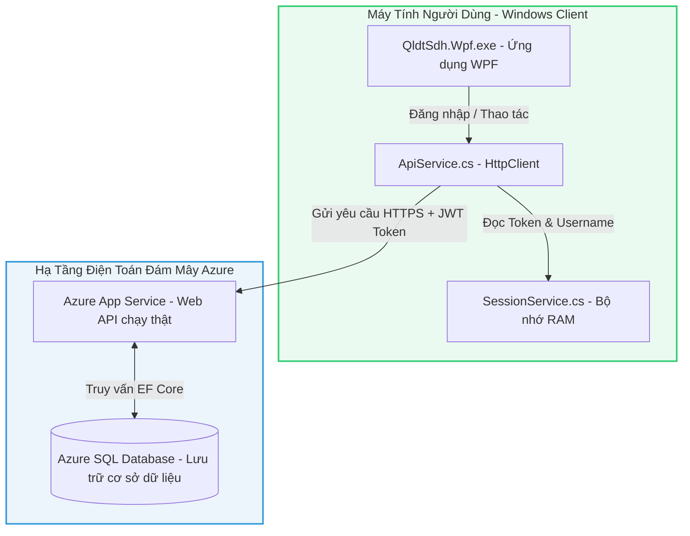
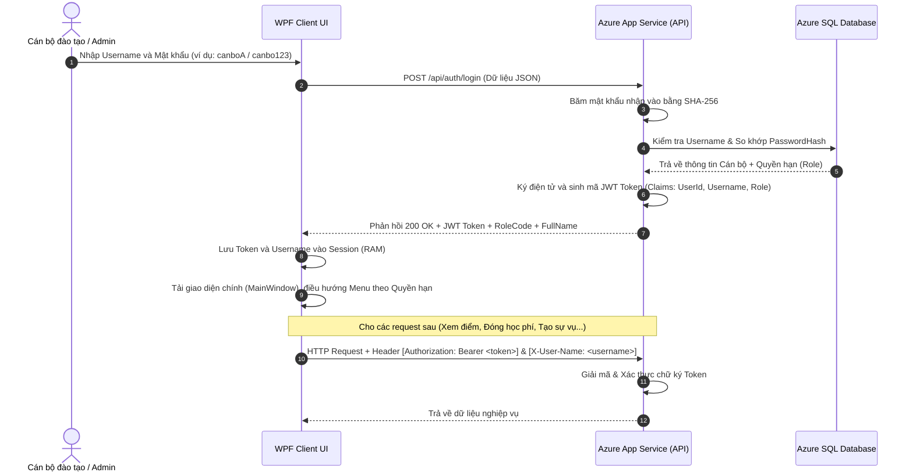
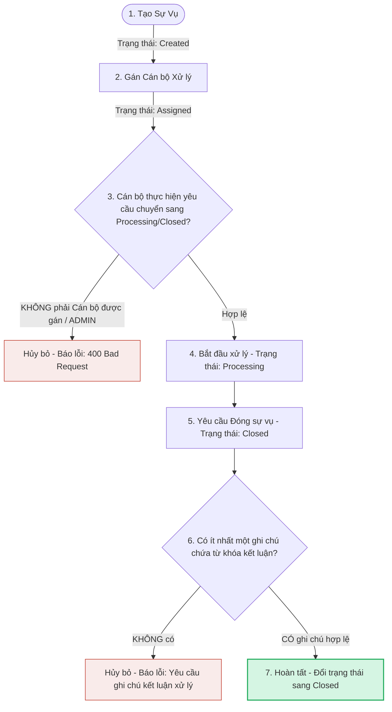

# TÀI LIỆU QUY TRÌNH VẬN HÀNH & TRIỂN KHAI HỆ THỐNG (DEPLOYMENT FLOW)

Tài liệu này tổng hợp toàn bộ luồng vận hành (Data Flow, Authentication Flow, Workflow) của dự án **Trung tâm điều hành và hồ sơ học viên 360°** trên môi trường chạy thật (Production) cùng quy trình đóng gói cài đặt.

---

## 🌐 1. Sơ Đồ Kiến Trúc Hoạt Động (System Architecture Flow)

Hệ thống chạy thật trên môi trường Cloud Azure kết nối đa phương tiện:



---

## 🔑 2. Luồng Xác Thực Hệ Thống (Authentication Flow)

Ứng dụng bảo mật bằng cơ chế Token-based Authentication (JWT Bearer):



---

## 🛠️ 3. Luồng Xử Lý Sự Vụ Hỗ Trợ (Case Management & Business Rules Flow)

Quy trình xử lý phản hồi khiếu nại của học viên tuân thủ nghiêm ngặt mô hình workflow và các ràng buộc nghiệp vụ:



---

## 📦 4. Quy Trình Triển Khai Thực Tế (Deployment Flow)

Quy trình đóng gói phần mềm và đưa lên chạy thật đã thực hiện thành công:

### 4.1. Quy Trình Triển Khai Web API (Backend)
1.  **Cấu hình CSDL Azure SQL:** Bật tính năng *"Allow Azure services and resources to access this server"* trên Azure Portal.
2.  **Publish ứng dụng:** Publish dự án `QldtSdh.WebApi` trực tiếp lên **Azure App Service** thông qua Visual Studio.
3.  **Cấu hình biến môi trường:** Cài đặt Connection String `ConnectionStrings__DefaultConnection` trên Cấu hình App Service của Azure Portal để đảm bảo kết nối CSDL bảo mật và tự động chạy cơ chế Seed Data khi khởi động.
4.  **Kích hoạt Swagger:** Bật cấu hình Swagger UI chạy ở cả môi trường Production giúp việc hiển thị danh sách API phục vụ báo cáo.

### 4.2. Quy Trình Triển Khai WPF App (Frontend)
1.  **Cấu hình API Endpoint:** Thay đổi `BaseAddress` trong file cấu hình `appsettings.json` của WPF trỏ về link API thật trên Azure: `https://qldtsdh-api-a6gcb9fcb3bffhf2.eastasia-01.azurewebsites.net/api/`.
2.  **Biên dịch Self-Contained:** Chạy lệnh biên dịch tự chứa runtime .NET 10 cho hệ điều hành Windows 64-bit:
    ```powershell
    dotnet publish -c Release -r win-x64 --self-contained true
    ```
    *Dữ liệu build thành công xuất ra tại thư mục: `frontend/QldtSdh.Wpf/bin/Release/net10.0-windows/win-x64/publish/`.*
3.  **Đóng gói bộ cài đặt Setup:** Sử dụng **Inno Setup** chạy tệp cấu hình [frontend/setup_config.iss](file:///c:/Users/DANGQUANGHOA/Desktop/Do-An-Dotnet/frontend/setup_config.iss) đóng gói toàn bộ thư mục xuất bản thành duy nhất **1 file cài đặt `QldtSdh_Setup.exe`**.
