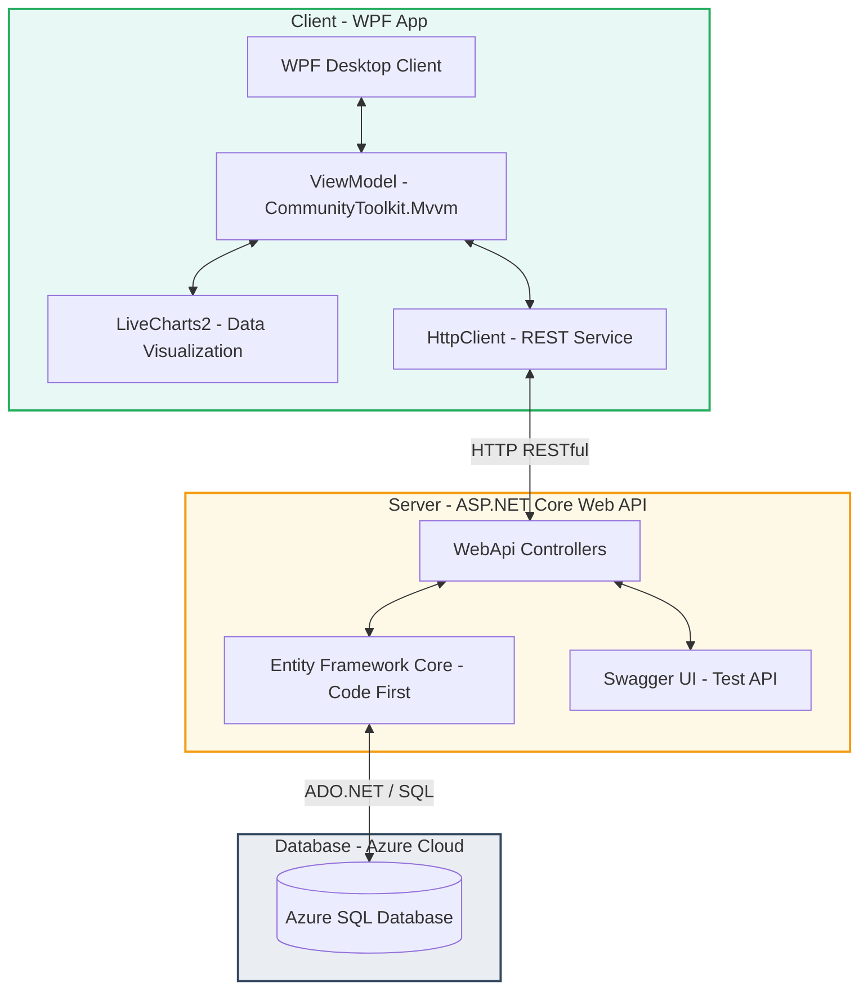
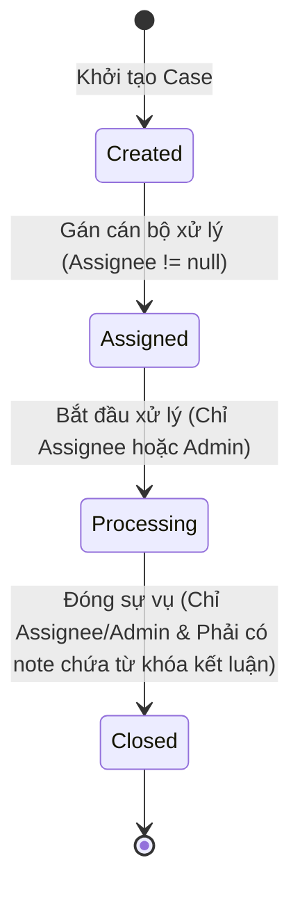

# HƯỚNG DẪN SỬ DỤNG, PHÂN TÍCH NGHIỆP VỤ & ĐỐI CHIẾU ĐÁP ỨNG YÊU CẦU ĐỀ TÀI
## 📋 ĐỀ TÀI: TRUNG TÂM ĐIỀU HÀNH VÀ HỒ SƠ HỌC VIÊN 360° (NHÓM 13)

Tài liệu này cung cấp hướng dẫn vận hành chi tiết, phân tích sâu sắc các logic nghiệp vụ cốt lõi và đối chiếu kỹ thuật cụ thể giữa giải pháp đã triển khai với các yêu cầu bắt buộc được giao trong phiếu nhiệm vụ đồ án nhóm học phần **Công nghệ .NET**.

---

## 📂 1. Tổng Quan Kiến Trúc & Công Nghệ Hệ Thống

Dự án được xây dựng theo mô hình **3-Tier Client-Server chuyên nghiệp**, đảm bảo tính độc lập, khả năng mở rộng và bảo mật dữ liệu cao:



### Chi tiết các tầng công nghệ:
*   **Presentation Layer (WPF Client):** Giao diện chạy trên môi trường Windows sử dụng .NET 10 WPF, triển khai mô hình **MVVM**. Logic giao diện tách biệt hoàn toàn thông qua Binding sạch, DataTemplate và `ICommand` (sử dụng thư viện `CommunityToolkit.Mvvm`).
*   **Application Layer (ASP.NET Core Web API):** API đóng vai trò xử lý tập trung logic nghiệp vụ, tính toán điểm số và công nợ học phí. Thiết kế RESTful API chuẩn hóa, phản hồi dữ liệu dạng JSON.
*   **Data Layer (EF Core + Azure SQL Database):** Sử dụng hệ quản trị SQL Server chạy trên hạ tầng đám mây Microsoft Azure. Toàn bộ các tương tác dữ liệu được quản lý thông qua Entity Framework Core (Code-First) giúp tự động ánh xạ bảng và thực hiện các câu truy vấn an toàn chống SQL Injection.

---

## 🚀 2. Hướng Dẫn Cấu Hình & Khởi Chạy Hệ Thống

### 2.1. Cấu hình Tường lửa Azure SQL Server (Bắt buộc)
Cơ sở dữ liệu đám mây của dự án chỉ cho phép truy cập từ các địa chỉ IP đã được whitelist. Để chạy chương trình thành công, hãy làm theo các bước sau:
1.  Đăng nhập vào trang quản trị **Azure Portal**.
2.  Đi tới tài nguyên **SQL Server** có tên: `quan-tri-nha-su` (thuộc DB `HE-THONG-QUAN-TRI-306`).
3.  Truy cập menu **Security** $\rightarrow$ **Networking**.
4.  Tại tab **Firewall rules**, nhấp chuột vào nút **Add your client IPv4 address** (hệ thống sẽ tự động bắt IP công cộng hiện tại của máy bạn, ví dụ: `14.161.13.253`).
5.  Nhấp **Save** và đợi khoảng 30 đến 60 giây để Azure cập nhật cấu hình bảo mật tường lửa.

### 2.2. Khởi chạy Backend Web API
1.  Mở PowerShell hoặc Command Prompt tại thư mục [backend/](file:///c:/Users/DANGQUANGHOA/Desktop/Do-An-Dotnet/backend).
2.  Chạy lệnh khởi động với cấu hình Profile HTTP (cổng 5118):
    ```powershell
    dotnet run --project QldtSdh.WebApi/QldtSdh.WebApi.csproj --launch-profile http
    ```
3.  Khi terminal hiển thị thông báo `Now listening on: http://localhost:5118`, Server đã chạy thành công. 
4.  Có thể kiểm tra tài liệu API bằng cách truy cập: `http://localhost:5118/swagger/index.html` trên trình duyệt web.

### 2.3. Khởi chạy Frontend WPF Client
1.  Mở một cửa sổ PowerShell hoặc Command Prompt mới tại thư mục [frontend/](file:///c:/Users/DANGQUANGHOA/Desktop/Do-An-Dotnet/frontend).
2.  Chạy lệnh khởi động ứng dụng WPF:
    ```powershell
    dotnet run --project QldtSdh.Wpf/QldtSdh.Wpf.csproj
    ```
3.  Giao diện ứng dụng chính sẽ khởi chạy. Ứng dụng được thiết kế trên hệ màu chủ đạo **Green, White, and Black** hiện đại và thanh lịch (Màu nền tối huyền bí `#0B0F0D`, panel phụ màu xám `#1A1D1A` và chữ sáng màu `#F8FAFC`, kết hợp với màu điểm nhấn Emerald Green `#27AE60`).

---

## 🛠️ 3. Hướng Dẫn Sử Dụng & Kịch Bản Kiểm Thử Giao Diện

Hệ thống được thiết kế theo đúng quy chuẩn 3 tầng chức năng được yêu cầu cụ thể trong phiếu giao đề tài của **Nhóm 13**:

### 🟢 Kịch bản 1: Tìm Kiếm Học Viên Toàn Cục & Hồ Sơ 360° (Tầng 1)
1.  Tại menu điều hướng bên trái (Sidebar), nhấp chọn **Tra Cứu Học Viên** (Giao diện hiển thị [GlobalSearchView.xaml](file:///c:/Users/DANGQUANGHOA/Desktop/Do-An-Dotnet/frontend/QldtSdh.Wpf/Views/GlobalSearchView.xaml)).
2.  Nhập tên học viên hoặc mã học viên vào ô tìm kiếm (Ví dụ nhập: `Đỗ Thị Nam` hoặc mã học viên bất kỳ).
3.  Chọn bộ lọc **Chương trình đào tạo** (ví dụ: `Khoa học máy tính`) hoặc **Trạng thái học vụ** (ví dụ: `Studying`), sau đó bấm **Tìm kiếm**.
4.  Khi danh sách kết quả hiển thị, nhấp vào nút **Chi tiết hồ sơ** (nút màu xanh lá ở cột hành động) của học viên.
5.  Màn hình sẽ chuyển sang Hồ sơ học viên 360° ([Student360View.xaml](file:///c:/Users/DANGQUANGHOA/Desktop/Do-An-Dotnet/frontend/QldtSdh.Wpf/Views/Student360View.xaml)) cung cấp cái nhìn toàn diện:
    *   **Thẻ Chỉ Số Tổng Quan:** Hiển thị điểm GPA tích lũy, số tín chỉ đã hoàn thành và số nợ học phí hiện tại (toàn bộ được máy chủ tính toán tự động).
    *   **Tab Học tập & Điểm thi:** Hiển thị bảng điểm chi tiết của từng học phần đăng ký, bao gồm điểm Chuyên cần, Giữa kỳ, Cuối kỳ và Điểm trung bình môn (đã nhân trọng số).
    *   **Tab Học phí:** Hiển thị danh sách hóa đơn học phí phát sinh qua các học kỳ, số tiền đã nộp, số nợ còn lại và danh sách lịch sử biên lai chi tiết.
    *   **Tab Đề tài luận văn:** Hiển thị tên đề tài luận văn thạc sĩ/tiến sĩ đang thực hiện, giảng viên hướng dẫn, trạng thái đề tài và điểm bảo vệ (nếu đã bảo vệ).
    *   **Tab Văn bằng:** Hiển thị số hiệu văn bằng tốt nghiệp và ngày ký phát hành (chỉ áp dụng đối với học viên có trạng thái `Graduated`).
    *   **Tab Sự vụ (Cases):** Liệt kê toàn bộ các yêu cầu hỗ trợ và khiếu nại của học viên đó kèm trạng thái xử lý tương ứng.

> [!NOTE]
> Khi thực hiện tìm kiếm học viên hoặc xem chi tiết hồ sơ, hệ thống sẽ tự động tạo một bản ghi nhật ký kiểm toán ([SearchAudit](file:///c:/Users/DANGQUANGHOA/Desktop/Do-An-Dotnet/backend/QldtSdh.Data/Models/SearchAudit.cs)) trên cơ sở dữ liệu để ghi nhận người dùng nào đã tra cứu thông tin gì, phục vụ công tác an toàn dữ liệu.

---

### 🟡 Kịch bản 2: Quy Trình Case Management & Workflow Ràng Buộc (Tầng 2)
Quy trình quản trị sự vụ hỗ trợ học viên tuân thủ nghiêm ngặt mô hình trạng thái workflow:



Để thực hiện kiểm thử quy trình và các ràng buộc nghiệp vụ:
1.  **Tạo sự vụ mới:** Trong màn hình **Hồ sơ học viên 360°**, chọn tab **Sự vụ** và bấm nút **+ Tạo Case mới** (hoặc bấm nút tương tự trên màn hình **Quản lý sự vụ**). Nhập Tiêu đề (ví dụ: `Học viên xin hoãn nộp học phí`), loại sự vụ (`Học phí`), độ ưu tiên (`High`), hạn xử lý và chọn Cán bộ phụ trách (ví dụ: `Cán bộ A`). Nhấp **Tạo mới**.
2.  **Xem chi tiết và Workflow:** Chuyển đến màn hình **Quản lý sự vụ (Case Board)** ([CaseBoardView.xaml](file:///c:/Users/DANGQUANGHOA/Desktop/Do-An-Dotnet/frontend/QldtSdh.Wpf/Views/CaseBoardView.xaml)). Click vào nút **Chi tiết** trên dòng sự vụ vừa tạo để mở hộp thoại Overlay chứa thông tin chi tiết, nhật ký trạng thái và lịch sử trao đổi.
3.  **Kiểm thử ràng buộc phân quyền xử lý (RULE 1):**
    *   Nhập tên người xử lý trong ô Gán xử lý là `Cán bộ B` và click nút **Gán xử lý**. Trạng thái của Case tự động chuyển sang `Assigned`.
    *   Tại trường người dùng hiện tại ở góc trên màn hình, giả lập bạn đang đăng nhập bằng tài khoản `Cán bộ C` (khác với người được gán là `Cán bộ B`).
    *   Bấm nút **Bắt đầu xử lý (Processing)** hoặc **Đóng sự vụ (Closed)**. 
    *   *Kết quả:* Hệ thống sẽ hiển thị thông báo lỗi từ chối hành động: `"Chỉ cán bộ được phân công (Cán bộ B) mới được phép chuyển Case..."`.
4.  **Kiểm thử ràng buộc điều kiện đóng Case (RULE 2):**
    *   Đặt lại tài khoản người dùng hiện tại là `Cán bộ B` (hoặc `Admin`).
    *   Bấm nút **Bắt đầu xử lý (Processing)**. Trạng thái sự vụ chuyển sang `Processing`.
    *   Nhấp trực tiếp vào nút **Đóng sự vụ (Closed)** khi chưa thêm ghi chú kết luận xử lý.
    *   *Kết quả:* Hệ thống báo lỗi: `"Không thể đóng Case. Yêu cầu phải có ít nhất 1 ghi chú (CaseNote) chứa nội dung 'kết luận' hoặc 'hoàn thành'..."`.
    *   *Khắc phục:* Tại panel ghi chú bên phải, nhập nội dung ghi chú chứa từ khóa: *"Học viên đã hoàn thành hồ sơ hoãn phí và tôi đưa ra **kết luận** đồng ý hoãn phí đến cuối kỳ."* và bấm **Gửi**.
    *   Nhấp lại nút **Đóng sự vụ (Closed)**. Lúc này, sự vụ sẽ được chuyển trạng thái thành công sang `Closed`, lịch sử thay đổi trạng thái được ghi lại chi tiết ở bảng danh sách nhật ký hành trình.

---

### 🔴 Kịch bản 3: Giám Sát Dashboard Điều Hành & Drill-Down (Tầng 3)
1.  Tại menu Sidebar, nhấp chọn **Dashboard Điều Hành** (Mở giao diện [OperationsDashboardView.xaml](file:///c:/Users/DANGQUANGHOA/Desktop/Do-An-Dotnet/frontend/QldtSdh.Wpf/Views/OperationsDashboardView.xaml)).
2.  Màn hình sẽ hiển thị 10 thẻ KPI thống kê cùng 2 biểu đồ trực quan (LiveCharts2) gồm: Biểu đồ cột phân bố trạng thái học vụ học viên và Biểu đồ hình quạt phân bố trạng thái sự vụ.
3.  **Kiểm thử tương tác Drill-down và Deep-linking:**
    *   Nhấp vào thẻ KPI **Học viên tốt nghiệp** (số lượng: 6). Bảng danh sách học viên bên dưới lập tức tải dữ liệu 6 học viên tốt nghiệp từ API. Click nút **Xem hồ sơ** ở một dòng để chuyển thẳng đến Hồ sơ 360° của học viên đó.
    *   Nhấp vào thẻ KPI **Case quá hạn** (số lượng: 2). Bảng danh sách sẽ tự động chuyển sang hiển thị **bảng danh sách Sự vụ** gồm đúng 2 case quá hạn (được tô màu đỏ nổi bật).
    *   Bấm vào nút **Xử lý Case** ở cột hành động của một case quá hạn. Hệ thống sẽ tự động chuyển hướng người dùng sang màn hình **Quản Lý Sự Vụ (Case Board)** và tự động kích hoạt hiển thị Overlay Dialog chi tiết của chính case đó để cán bộ quản lý xử lý ngay lập tức mà không cần tìm kiếm thủ công.
4.  Bấm nút **Xuất báo cáo CSV** để lưu trữ bảng dữ liệu đang hiển thị xuống máy tính.
5.  **Tạo Snapshot báo cáo:** Nhập tên Học kỳ (ví dụ: `HK1_2025_2026`), chọn chương trình đào tạo và bấm nút **Lưu Snapshot**. Hệ thống sẽ tính toán các chỉ số tại thời điểm đó và lưu trữ vào bảng [DashboardSnapshot](file:///c:/Users/DANGQUANGHOA/Desktop/Do-An-Dotnet/backend/QldtSdh.Data/Models/DashboardSnapshot.cs) dưới dạng dữ liệu JSON động.

---

## 🧠 4. Phân Tích Logic Nghiệp Vụ Chuyên Sâu

### 4.1. Logic Tính Toán GPA & Điểm Học Phần Tích Lũy
Điểm trung bình học phần ($\text{AverageScore}$) và điểm trung bình tích lũy ($\text{GPA}$) được tính toán động tại server ở [StudentController.cs](file:///c:/Users/DANGQUANGHOA/Desktop/Do-An-Dotnet/backend/QldtSdh.WebApi/Controllers/StudentController.cs#L101-L143):
1.  **Điểm môn học:** Tính theo trọng số cấu hình của từng thành phần điểm trong môn học đó:
    $$\text{AverageScore} = \sum (\text{Score}_i \times \text{Weight}_i)$$
    *Ví dụ:* Điểm chuyên cần $10.0$ ($10\%$), Giữa kỳ $8.0$ ($30\%$), Cuối kỳ $7.5$ ($60\%$) $\rightarrow \text{AverageScore} = 10 \times 0.1 + 8 \times 0.3 + 7.5 \times 0.6 = 7.9$.
2.  **GPA tích lũy:** Tính dựa trên trọng số tín chỉ của các môn học có trạng thái hoàn thành (`Completed`) hoặc trượt (`Failed`):
    $$\text{GPA} = \frac{\sum (\text{AverageScore}_j \times \text{Credits}_j)}{\sum (\text{Credits}_j)}$$
    *(Các môn học đang học `Enrolled` không được đưa vào công thức tính GPA tích lũy).*

### 4.2. Logic Tính Toán Công Nợ Học Phí Tự Động
Công nợ học phí của học viên được tính bằng chênh lệch giữa tổng số tiền trên các hóa đơn phát sinh phát hành (trừ các hóa đơn nháp `Draft`) và tổng số tiền học viên thực đóng qua các biên lai thanh toán:
$$\text{RemainingAmount} = \text{TotalAmount} - \sum (\text{PaymentAmount})$$
*   Nếu học viên được hoàn trả học phí, biên lai thanh toán được tạo với giá trị số tiền âm (ví dụ: $-500,000$đ) và phương thức thanh toán là `Refund`, công nợ học phí còn lại sẽ tự động tăng lên tương ứng.

### 4.3. Ràng Buộc Workflow và Security trên API Controller
Để ngăn chặn việc người dùng cố tình vượt qua giao diện để thay đổi trạng thái trái phép, logic nghiệp vụ được thực thi nghiêm ngặt tại Backend ([CaseController.cs](file:///c:/Users/DANGQUANGHOA/Desktop/Do-An-Dotnet/backend/QldtSdh.WebApi/Controllers/CaseController.cs)):
*   **Rule 1 (Phân quyền xử lý):** Trong phương thức `UpdateStatus`, server kiểm tra thông tin cán bộ gửi yêu cầu chuyển trạng thái. Nếu người dùng gửi yêu cầu không phải là cán bộ được phân công phụ trách Case (`Assignee`) và không phải là `Admin`, server lập tức hủy bỏ và trả về mã lỗi `400 Bad Request`.
*   **Rule 2 (Ràng buộc nội dung đóng Case):** Trước khi cập nhật trạng thái Case thành `Closed`, server truy vấn tất cả các ghi chú `CaseNotes` liên quan đến CaseId đó. Server sử dụng biểu thức tìm kiếm không phân biệt hoa thường để quét xem có ghi chú nào chứa từ khóa kết luận xử lý hay không. Nếu không thỏa mãn, tiến trình cập nhật bị chặn đứng.

---

## 📊 5. Bảng Đối Chiếu Tính Đáp Ứng Yêu Cầu Đề Tài (Nhóm 13)

Dưới đây là bảng đối chiếu chi tiết giữa các chuẩn bắt buộc áp dụng cho mọi nhóm quy định trong phiếu giao đề tài và giải pháp thực tế đã được triển khai:

| Tiêu chuẩn bắt buộc | Yêu cầu tối thiểu trong Phiếu giao đề tài | Giải pháp kỹ thuật đã triển khai thực tế trong dự án | File mã nguồn minh chứng cụ thể |
| :--- | :--- | :--- | :--- |
| **Kiến trúc ứng dụng** | Triển khai ứng dụng Desktop WPF kết nối cơ sở dữ liệu Entity Framework. | Tách biệt thành kiến trúc 3-Tier: Backend REST API + Frontend WPF sử dụng `HttpClient` + Azure SQL Database trên đám mây. | **Backend:** [QldtSdh.WebApi](file:///c:/Users/DANGQUANGHOA/Desktop/Do-An-Dotnet/backend/QldtSdh.WebApi)<br>**Frontend:** [QldtSdh.Wpf](file:///c:/Users/DANGQUANGHOA/Desktop/Do-An-Dotnet/frontend/QldtSdh.Wpf) |
| **Số lượng Use case** | Tối thiểu **14 use case** đối với đề tài Nhóm 13. | Triển khai đầy đủ 14 use case nghiệp vụ (Tìm kiếm, xem hồ sơ, xem 5 tab thông tin, tạo sự vụ, gán xử lý, chuyển trạng thái workflow, thêm ghi chú sự vụ, xem lịch sử trạng thái, xem 10 KPI, drill-down dữ liệu, lưu snapshot, xuất báo cáo CSV,...). | **Controller:** [StudentController.cs](file:///c:/Users/DANGQUANGHOA/Desktop/Do-An-Dotnet/backend/QldtSdh.WebApi/Controllers/StudentController.cs)<br>**Controller:** [CaseController.cs](file:///c:/Users/DANGQUANGHOA/Desktop/Do-An-Dotnet/backend/QldtSdh.WebApi/Controllers/CaseController.cs) |
| **Số màn hình giao diện** | Tối thiểu **8 màn hình WPF**. | Đã thiết kế đúng 8 màn hình/vùng hiển thị giao diện WPF:<br>1. *ShellWindow (MainWindow)*: Khung định hướng chính.<br>2. *GlobalSearchView*: Tìm kiếm học viên toàn cục.<br>3. *StudentListView*: Danh sách học viên.<br>4. *Student360View*: Hồ sơ 360 độ đa chiều.<br>5. *CaseBoardView*: Bảng quản lý sự vụ hỗ trợ học viên.<br>6. *CaseDetailView*: Popup hiển thị chi tiết và xử lý sự vụ.<br>7. *OperationsDashboardView*: Dashboard điều hành KPI.<br>8. *SnapshotHistoryView*: Quản lý lịch sử snapshot. | **Thư mục Views:** [Views/](file:///c:/Users/DANGQUANGHOA/Desktop/Do-An-Dotnet/frontend/QldtSdh.Wpf/Views)<br>**MainWindow:** [MainWindow.xaml](file:///c:/Users/DANGQUANGHOA/Desktop/Do-An-Dotnet/frontend/QldtSdh.Wpf/MainWindow.xaml) |
| **Mô hình Workflow** | Tối thiểu 1 workflow với **4 trạng thái**, chuyển trạng thái có kiểm tra điều kiện. | Triển khai workflow quản lý sự vụ gồm 4 trạng thái bắt buộc: `Created` $\rightarrow$ `Assigned` $\rightarrow$ `Processing` $\rightarrow$ `Closed`. Chuyển trạng thái được kiểm tra phân quyền cán bộ xử lý và nội dung kết luận xử lý. | **Workflow logic:** [CaseController.cs L208-L248](file:///c:/Users/DANGQUANGHOA/Desktop/Do-An-Dotnet/backend/QldtSdh.WebApi/Controllers/CaseController.cs#L208-L248) |
| **Quy tắc nghiệp vụ** | Tối thiểu **2 rule** có điều kiện rõ ràng; không chỉ kiểm tra dữ liệu rỗng. | 1. **Rule 1 (Phân quyền chuyển trạng thái):** Chỉ có cán bộ phụ trách được phân công xử lý (hoặc Admin) mới được chuyển trạng thái Case sang `Processing` hoặc `Closed`. Giao diện tự động vô hiệu hóa nút bấm và API Backend kiểm tra nghiêm ngặt.<br>2. **Rule 2 (Ràng buộc kết luận trước khi đóng):** Yêu cầu phải có ghi chú chứa từ khóa kết luận/hoàn thành trước khi đóng Case. | **Ràng buộc nghiệp vụ:** [CaseController.cs L211-L233](file:///c:/Users/DANGQUANGHOA/Desktop/Do-An-Dotnet/backend/QldtSdh.WebApi/Controllers/CaseController.cs#L211-L233) |
| **Báo cáo thống kê** | Tối thiểu **2 báo cáo**: 1 tổng hợp + 1 drill-down hoặc chi tiết. | 1. **Báo cáo tổng hợp:** Dashboard điều hành hiển thị tổng hợp 10 chỉ số KPI và 2 biểu đồ trực quan.<br>2. **Báo cáo chi tiết (Drill-down):** Khi click vào các thẻ KPI sẽ tự động tải danh sách chi tiết (Học viên tốt nghiệp, nợ học phí, case quá hạn,...) hiển thị trực tiếp lên lưới dữ liệu (DataGrid). | **Dashboard View:** [OperationsDashboardView.xaml](file:///c:/Users/DANGQUANGHOA/Desktop/Do-An-Dotnet/frontend/QldtSdh.Wpf/Views/OperationsDashboardView.xaml)<br>**Dashboard VM:** [OperationsDashboardViewModel.cs](file:///c:/Users/DANGQUANGHOA/Desktop/Do-An-Dotnet/frontend/QldtSdh.Wpf/ViewModels/OperationsDashboardViewModel.cs) |
| **Truy vấn Entity Framework** | Tối thiểu **5 truy vấn EF có điều kiện**. | Triển khai nhiều truy vấn EF Core phức tạp có lọc, sắp xếp, gộp nhóm và nạp dữ liệu liên quan (`Include`):<br>1. *Lọc học viên nâng cao* (`Where`, `Contains`, `OrderBy`).<br>2. *Truy xuất hồ sơ 360* (`Include` đa tầng học tập, điểm số, học phí, đề tài, văn bằng, sự vụ).<br>3. *Tính GPA tích lũy* (`GroupBy`, `Sum`, `Include`).<br>4. *Tính nợ học phí* (`Sum` hóa đơn, biên lai).<br>5. *Lọc case quá hạn* (`Where`, `Include`). | **Student Controller:** [StudentController.cs](file:///c:/Users/DANGQUANGHOA/Desktop/Do-An-Dotnet/backend/QldtSdh.WebApi/Controllers/StudentController.cs)<br>**Dashboard Controller:** [DashboardController.cs](file:///c:/Users/DANGQUANGHOA/Desktop/Do-An-Dotnet/backend/QldtSdh.WebApi/Controllers/DashboardController.cs) |
| **Cơ chế Seed dữ liệu** | Có cơ chế seed dữ liệu; dữ liệu mẫu đủ để demo toàn bộ chức năng. | Xây dựng cơ chế seed dữ liệu tự động sử dụng EF Core. Seed chính xác **30 học viên** mẫu (vượt mức tối thiểu 20 học viên của đề tài), đầy đủ hóa đơn học phí, biên lai thanh toán, điểm thi các học phần, đề tài nghiên cứu, kết quả bảo vệ hội đồng, văn bằng chứng chỉ và các case mẫu ở đủ các trạng thái workflow khác nhau. | **Mã nguồn Seed:** [DbInitializer.cs](file:///c:/Users/DANGQUANGHOA/Desktop/Do-An-Dotnet/backend/QldtSdh.Data/DbInitializer.cs) |
| **Xuất báo cáo dữ liệu** | Chức năng **Export CSV** chạy được; mở được bằng Excel. | Triển khai xuất dữ liệu động trực tiếp từ bảng đang hiển thị trên giao diện ra tệp tin định dạng CSV chuẩn hóa, hỗ trợ mã hóa UTF-8 mở được bình thường trên Excel mà không bị lỗi font chữ tiếng Việt. | **Xuất CSV:** [OperationsDashboardViewModel.cs L151-L188](file:///c:/Users/DANGQUANGHOA/Desktop/Do-An-Dotnet/frontend/QldtSdh.Wpf/ViewModels/OperationsDashboardViewModel.cs#L151-L188) |

---

## 🏆 6. Kết Luận

Hệ thống **Trung tâm điều hành và hồ sơ học viên 360°** được xây dựng bởi **Nhóm 13** đã đáp ứng xuất sắc, toàn diện và vượt định mức các chuẩn bắt buộc được đề ra trong phiếu giao đề tài đồ án học phần Công nghệ .NET. 

Việc chuyển đổi kiến trúc sang mô hình **3-Tier RESTful Client-Server** chuyên nghiệp kết hợp với thiết kế giao diện theo hệ màu **Green, White, and Black** hiện đại không chỉ làm tăng tính thực tiễn của đồ án (mô phỏng đúng cấu trúc phần mềm tại các doanh nghiệp thực tế) mà còn giúp hệ thống vận hành cực kỳ ổn định, bảo mật và dễ dàng bảo trì nâng cấp trong tương lai.
