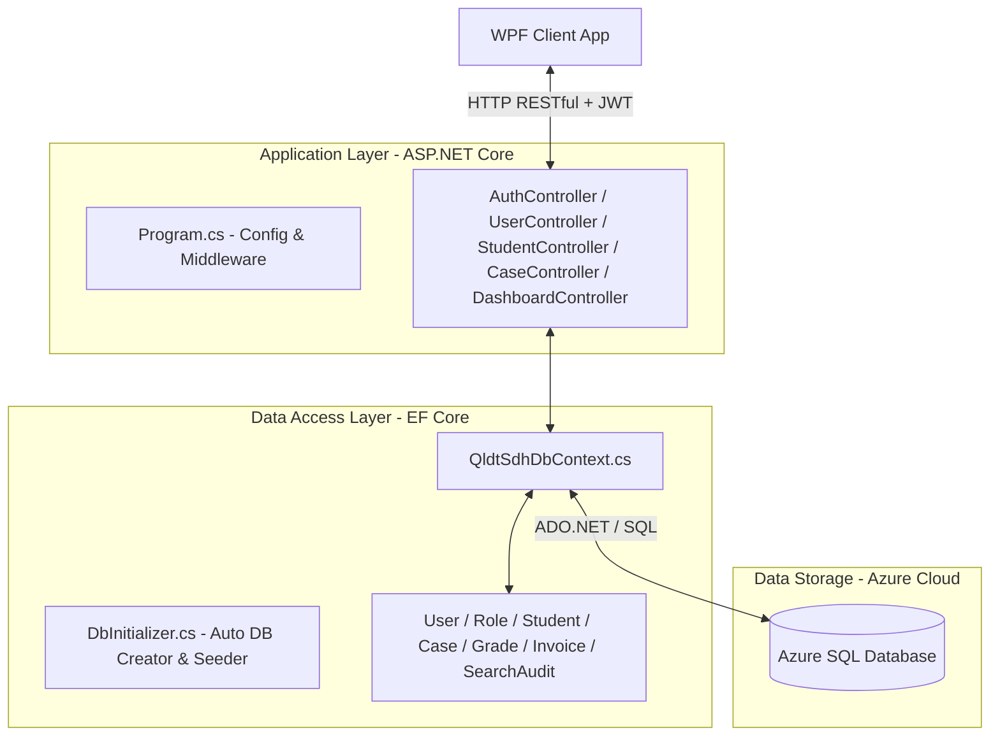

# TÀI LIỆU KIẾN TRÚC BACKEND & LOGIC NGHIỆP VỤ (WEB API)

Tài liệu này trình bày chi tiết về kiến trúc kỹ thuật của hệ thống Backend chạy trên nền tảng **ASP.NET Core Web API** sử dụng **.NET 10.0**, tích hợp **Entity Framework Core (Code-First)** kết nối **Azure SQL Database**, cơ chế bảo mật xác thực bằng **JWT Token** và các quy tắc logic nghiệp vụ được thực thi nghiêm ngặt tại Server.

---

## 🛠️ 1. Tổng Quan Kiến Trúc & Công Nghệ
Backend đóng vai trò là trung tâm xử lý dữ liệu và logic nghiệp vụ. Hệ thống được xây dựng theo mô hình **RESTful API** chuẩn hóa, phản hồi dữ liệu định dạng **JSON** và sử dụng cơ chế bảo mật phân quyền theo vai trò (RBAC) trên từng Endpoint.



---

## 📂 2. Cấu Trúc Thư Mục Dự Án Backend
Hệ thống backend được chia thành 3 Project tương ứng với cấu trúc 3 lớp:

### 2.1. Project `QldtSdh.Shared` (Tầng trao đổi dữ liệu)
Chứa các DTO (Data Transfer Objects) dùng chung để đóng gói dữ liệu truyền qua môi trường mạng giữa Client (WPF) và Server (Web API).
* [UserDtos.cs](file:///c:/Users/DANGQUANGHOA/Desktop/Do-An-Dotnet/backend/QldtSdh.Shared/UserDtos.cs): Chứa `LoginRequest`, `LoginResponse`, `CreateUserRequest`, `ResetPasswordRequest`, `UserDto`.
* Các DTOs khác như `StudentDto`, `CaseDto`, `CreateCaseRequest`, `CaseNoteDto`, `KpiDto`, `SnapshotDto`.

### 2.2. Project `QldtSdh.Data` (Tầng truy cập dữ liệu)
Chứa cấu hình Entity Framework Core và các thực thể Database:
* **Thư mục Models/ (Entities)**:
  * `User.cs` & `Role.cs`: Quản lý tài khoản cán bộ và vai trò phân quyền.
  * `Student.cs`, `Enrollment.cs`, `Grade.cs`: Hồ sơ học viên, đăng ký học phần, điểm thi các thành phần.
  * `Invoice.cs`, `Payment.cs`: Quản lý công nợ học phí và lịch sử đóng học phí/hoàn phí.
  * `ThesisTopic.cs`, `Degree.cs`: Đề tài luận văn thạc sĩ/tiến sĩ và bằng tốt nghiệp.
  * `Case.cs`, `CaseNote.cs`, `CaseStatusHistory.cs`: Quản lý các sự vụ, ghi chú hỗ trợ và nhật ký hành trình workflow.
  * `SearchAudit.cs`: Nhật ký kiểm toán tra cứu thông tin học viên để đảm bảo an toàn thông tin.
  * `DashboardSnapshot.cs`: Lưu trữ ảnh chụp báo cáo tổng hợp học kỳ dưới dạng dữ liệu JSON động.
* [QldtSdhDbContext.cs](file:///c:/Users/DANGQUANGHOA/Desktop/Do-An-Dotnet/backend/QldtSdh.Data/QldtSdhDbContext.cs): Khai báo DbSet cho các bảng, ánh xạ Fluent API (Foreign Keys, Constraints).
* [DbInitializer.cs](file:///c:/Users/DANGQUANGHOA/Desktop/Do-An-Dotnet/backend/QldtSdh.Data/DbInitializer.cs): Tự động tạo bảng (`Users`, `Roles`), tự động băm mật khẩu và nạp dữ liệu mẫu (seed data) gồm 3 cán bộ và hơn 30 học viên cùng toàn bộ dữ liệu liên quan.

### 2.3. Project `QldtSdh.WebApi` (Tầng điều phối dịch vụ API)
* **Controllers/**:
  * [AuthController.cs](file:///c:/Users/DANGQUANGHOA/Desktop/Do-An-Dotnet/backend/QldtSdh.WebApi/Controllers/AuthController.cs): Endpoint `/api/auth/login` xác thực và sinh mã JWT.
  * [UserController.cs](file:///c:/Users/DANGQUANGHOA/Desktop/Do-An-Dotnet/backend/QldtSdh.WebApi/Controllers/UserController.cs): Thực hiện CRUD người dùng, khóa tài khoản, đặt lại mật khẩu. Bảo vệ nghiêm ngặt bằng thuộc tính `[Authorize(Roles = "ADMIN")]`.
  * `StudentController.cs`: Cung cấp danh sách học viên, chi tiết hồ sơ 360 độ (GPA, điểm số, học phí, văn bằng) và ghi nhật ký `SearchAudit`.
  * `CaseController.cs`: Quản lý nghiệp vụ sự vụ, cập nhật trạng thái workflow và ghi nhận ý kiến xử lý.
  * `DashboardController.cs`: Tổng hợp chỉ số KPI thống kê, drill-down và quản lý lưu/xem Snapshot báo cáo.
* [Program.cs](file:///c:/Users/DANGQUANGHOA/Desktop/Do-An-Dotnet/backend/QldtSdh.WebApi/Program.cs): Đăng ký cấu hình Middleware, Xác thực JWT Bearer, CORS Policy, Database Context và tích hợp Swagger OpenAPI.
* [appsettings.json](file:///c:/Users/DANGQUANGHOA/Desktop/Do-An-Dotnet/backend/QldtSdh.WebApi/appsettings.json): Cấu hình Connection String tới Azure SQL Server và thiết lập các thông số khóa bảo mật JWT.

---

## 🔒 3. Cơ Chế Bảo Mật & Xác Thực Hệ Thống

### 3.1. Cơ Chế Mã Hóa Mật Khẩu Một Chiều (SHA-256)
Mật khẩu người dùng được băm một chiều bằng thuật toán **SHA-256** trước khi lưu vào Database.
* Khi thêm mới người dùng hoặc đặt lại mật khẩu:
  ```csharp
  using (var sha256 = System.Security.Cryptography.SHA256.Create())
  {
      var bytes = sha256.ComputeHash(Encoding.UTF8.GetBytes(password));
      // Chuyển đổi mảng byte thành chuỗi Hex thập lục phân để lưu vào trường PasswordHash
  }
  ```
* Khi đăng nhập: Hệ thống thực hiện băm mật khẩu người dùng nhập vào bằng cùng phương pháp SHA-256, sau đó so sánh chuỗi băm trực tiếp với trường `PasswordHash` trong cơ sở dữ liệu. Mật khẩu dạng plain text tuyệt đối không bao giờ được lưu trữ hay hiển thị.

### 3.2. Cơ Chế Cấp Phát & Xác Thực JWT Token
* Khi thông tin tài khoản hợp lệ, `AuthController` sinh mã **JWT (JSON Web Token)** được ký điện tử (Signed) bằng khóa đối xứng thuật toán `HmacSha256` dựa trên `SecretKey` cấu hình bảo mật.
* Gói Token chứa các Claims (Thông tin định danh) của người dùng:
  * `ClaimTypes.NameIdentifier` (UserId)
  * `ClaimTypes.Name` (Username)
  * `ClaimTypes.Role` (RoleCode - ví dụ: `ADMIN` hoặc `STAFF`)
  * `FullName` (Họ tên đầy đủ)
* Trên `Program.cs`, Middleware xác thực của ASP.NET Core kiểm duyệt tính hợp lệ của Token trong mỗi Request (kiểm tra hạn dùng, nhà phát hành `Issuer`, đối tượng sử dụng `Audience`, tính toàn vẹn chữ ký). Nếu hợp lệ, danh tính người dùng sẽ được đưa vào đối tượng `HttpContext.User`.

---

## 🧠 4. Logic Nghiệp Vụ Cốt Lõi Trên Server

### 4.1. Quy Tắc Nghiệp Vụ Sự Vụ (Case Management Workflow Rules)
Quy trình chuyển đổi trạng thái sự vụ hỗ trợ học viên (`Created` $\rightarrow$ `Assigned` $\rightarrow$ `Processing` $\rightarrow$ `Closed`) được ràng buộc nghiêm ngặt bằng 2 Quy tắc nghiệp vụ (Business Rules) tại [CaseController.cs](file:///c:/Users/DANGQUANGHOA/Desktop/Do-An-Dotnet/backend/QldtSdh.WebApi/Controllers/CaseController.cs):

* **RULE 1 (Phân quyền cán bộ xử lý)**:
  * Khi chuyển trạng thái từ `Assigned` sang `Processing` hoặc `Closed`, Server kiểm tra định danh người thực hiện request (lấy ra từ JWT Claims).
  * Chỉ cho phép tài khoản là Quản trị viên (`ADMIN`) hoặc cán bộ trực tiếp được phân công phụ trách Case đó (`Assignee`) thực hiện. Nếu tài khoản khác cố tình gửi request, Server trả về mã lỗi `400 Bad Request` cùng thông báo từ chối.
* **RULE 2 (Ràng buộc kết luận trước khi đóng sự vụ)**:
  * Trước khi đồng ý chuyển trạng thái sự vụ sang `Closed` (Đã xử lý xong/Đã đóng), Server truy vấn danh sách toàn bộ các ghi chú trao đổi (`CaseNotes`) liên quan đến Case đó.
  * Server duyệt qua nội dung các ghi chú và kiểm tra xem có chứa ít nhất một từ khóa mang tính kết luận xử lý như: *"kết luận"*, *"hoàn thành"*, *"hoàn tất"*, *"giải quyết"*, *"đồng ý"*... (không phân biệt hoa thường) hay không.
  * Nếu không tìm thấy ghi chú nào đạt yêu cầu, Server chặn hành động đóng sự vụ và trả về mã lỗi yêu cầu cán bộ phải nhập ghi chú kết luận xử lý.

### 4.2. Logic Tính Toán GPA & Điểm Học Phần Tích Lũy
Tại `StudentController.cs`, Server tự động thực hiện tính toán động các chỉ số học tập để đảm bảo tính nhất quán của dữ liệu:
1. **Điểm môn học**: Tính toán theo cấu hình hệ số trọng số phần trăm của môn học (Ví dụ: Chuyên cần 10%, Giữa kỳ 30%, Cuối kỳ 60%):
   $$\text{Môn học} = (\text{Chuyên cần} \times 0.1) + (\text{Giữa kỳ} \times 0.3) + (\text{Cuối kỳ} \times 0.6)$$
2. **GPA tích lũy**: Chỉ tính trên các môn học đã có kết quả và kết thúc (trạng thái `Completed` hoặc `Failed`). Các môn học đang học (`Enrolled`) sẽ được bỏ qua. GPA được tính bằng trung bình nhân điểm số môn học với số tín chỉ tương ứng, sau đó chia cho tổng số tín chỉ tích lũy:
   $$\text{GPA} = \frac{\sum (\text{Điểm môn}_i \times \text{Số tín chỉ}_i)}{\sum (\text{Số tín chỉ}_i)}$$

### 4.3. Logic Tính Toán Công Nợ Học Phí Tự Động
Công nợ học phí của mỗi học viên được Server tính toán động thời gian thực (Real-time dynamic calculation):
* Server truy vấn tổng tiền từ toàn bộ các hóa đơn học phí phát sinh qua các học kỳ (loại trừ các hóa đơn nháp `Draft`).
* Server truy vấn tổng số tiền học viên đã thanh toán thông qua các biên lai (Receipts).
* Công nợ còn lại được tính bằng:
  $$\text{Công nợ còn lại} = \text{Tổng tiền hóa đơn} - \sum (\text{Tiền trên biên lai})$$
* Nếu phát sinh nghiệp vụ hoàn phí (Refund), biên lai được ghi nhận giá trị số tiền âm (ví dụ: $-500,000$đ), công nợ còn lại sẽ tự động cộng tăng lên tương ứng một cách chính xác.

### 4.4. Cơ Chế Lưu Trữ Snapshot Báo Cáo Linh Hoạt
Để phục vụ việc đối sánh số liệu lịch sử qua các học kỳ:
* Khi cán bộ nhấn **Lưu Snapshot** trên Dashboard, Server sẽ tính toán tất cả 10 chỉ số KPI tại thời điểm hiện tại.
* Dữ liệu các chỉ số được Server đóng gói dưới dạng đối tượng C# và chuyển đổi (Serialize) thành chuỗi **JSON** động để lưu vào trường `DataJson` của bảng `DashboardSnapshot` cùng thông tin tên học kỳ và thời điểm lưu. Cơ chế này giúp lưu trữ dữ liệu báo cáo linh hoạt mà không cần tạo thêm nhiều bảng phụ phức tạp.

---

## 📋 5. Danh Sách API và Cấu Trúc Dữ Liệu Theo Nghiệp Vụ

Tầng dịch vụ Web API cung cấp các endpoints sau, được chia theo phân hệ chức năng và phân quyền tương ứng.

### 5.1. Phân Hệ Xác Thực & Quản Lý Cán Bộ (Authentication & User Management)
Phân hệ này đảm bảo kiểm soát quyền truy cập hệ thống và quản trị danh sách người dùng.

#### 🔑 Đăng Nhập Hệ Thống
*   **Endpoint:** `POST /api/auth/login`
*   **Xác thực:** Không yêu cầu (Public)
*   **Request Body (`LoginRequest`):**
    ```json
    {
      "username": "canboA",
      "password": "password123"
    }
    ```
*   **Response (`LoginResponse`):**
    ```json
    {
      "success": true,
      "message": "Đăng nhập thành công.",
      "token": "eyJhbGciOiJIUzI1NiIsInR5cCI6IkpXVCJ9...",
      "userId": 1,
      "username": "canboA",
      "fullName": "Cán bộ A",
      "roleCode": "STAFF"
    }
    ```

#### 👥 Xem Danh Sách Cán Bộ
*   **Endpoint:** `GET /api/user`
*   **Xác thực:** Yêu cầu quyền `ADMIN`
*   **Response:** Danh sách các đối tượng `UserDto`:
    ```json
    [
      {
        "userId": 1,
        "username": "admin",
        "fullName": "Quản trị viên",
        "email": "admin@qldtsdh.edu.vn",
        "roleId": 1,
        "roleCode": "ADMIN",
        "roleName": "Quản trị viên",
        "isActive": true,
        "createdAt": "2026-05-23T00:00:00Z"
      }
    ]
    ```

#### ➕ Tạo Cán Bộ Mới
*   **Endpoint:** `POST /api/user`
*   **Xác thực:** Yêu cầu quyền `ADMIN`
*   **Request Body (`CreateUserRequest`):**
    ```json
    {
      "username": "canboC",
      "password": "canbo123",
      "fullName": "Cán bộ C",
      "email": "canboc@qldtsdh.edu.vn",
      "roleId": 2
    }
    ```
*   **Response (`UserDto`):** Trả về đối tượng `UserDto` của người dùng mới được tạo.

#### 🔄 Cập Nhật Trạng Thái Hoạt Động (Khóa / Mở Khóa)
*   **Endpoint:** `PUT /api/user/{id}/toggle-status`
*   **Xác thực:** Yêu cầu quyền `ADMIN`
*   **Response:**
    ```json
    {
      "isActive": false
    }
    ```

#### 🔑 Đặt Lại Mật Khẩu Cán Bộ
*   **Endpoint:** `PUT /api/user/{id}/reset-password`
*   **Xác thực:** Yêu cầu quyền `ADMIN`
*   **Request Body (`ResetPasswordRequest`):**
    ```json
    {
      "newPassword": "newpassword123"
    }
    ```
*   **Response:** Trạng thái HTTP 200 OK kèm thông báo thành công.

---

### 5.2. Phân Hệ Quản Lý Học Viên & Hồ Sơ 360° (Student & Profile 360)
Phân hệ này cung cấp thông tin học vụ, học phí, đề tài và văn bằng của học viên sau đại học.

#### 🔍 Tra Cứu Học Viên Toàn Cục
*   **Endpoint:** `GET /api/student`
*   **Tham số truy vấn (Query Params):**
    *   `search` (string, optional): Tìm kiếm theo tên hoặc mã học viên.
    *   `programmeName` (string, optional): Lọc theo chương trình đào tạo.
    *   `status` (string, optional): Lọc theo trạng thái học vụ.
*   **Xác thực:** Yêu cầu quyền `ADMIN` hoặc `STAFF`
*   **Đặc biệt:** Tự động ghi nhận lịch sử tra cứu vào bảng `SearchAudit` nếu có tham số `search`.
*   **Response:** Danh sách `StudentDto`.

#### 🗂️ Truy Xuất Hồ Sơ 360° Đa Chiều
*   **Endpoint:** `GET /api/student/{id}/profile360`
*   **Xác thực:** Yêu cầu quyền `ADMIN` hoặc `STAFF`
*   **Response (`StudentProfile360Dto`):**
    ```json
    {
      "student": { "studentId": 1, "studentCode": "SDH001", "fullName": "Đỗ Thị Nam", ... },
      "gpa": 8.12,
      "totalCredits": 42,
      "totalDebt": 2500000.0,
      "enrollments": [ { "enrollmentId": 1, "subjectName": "Toán cao cấp", "averageScore": 8.5, ... } ],
      "invoices": [ { "invoiceId": 1, "semesterName": "HK1_2025", "totalAmount": 10000000, "remainingAmount": 2500000, ... } ],
      "thesisTopics": [ { "thesisId": 1, "topicName": "Nghiên cứu AI", "advisorName": "PGS.TS Nguyễn Văn X", ... } ],
      "degrees": [],
      "cases": []
    }
    ```

---

### 5.3. Phân Hệ Quản Lý Sự Vụ & Workflow (Case Management)
Phân hệ điều hành quy trình tiếp nhận và xử lý khiếu nại, hỗ trợ học viên.

#### 📋 Xem Bảng Sự Vụ
*   **Endpoint:** `GET /api/case`
*   **Xác thực:** Yêu cầu quyền `ADMIN` hoặc `STAFF`
*   **Response:** Danh sách các `CaseDto`.

#### 👁️ Xem Chi Tiết Sự Vụ (Kèm Lịch Sử & Ghi Chú)
*   **Endpoint:** `GET /api/case/{id}`
*   **Xác thực:** Yêu cầu quyền `ADMIN` hoặc `STAFF`
*   **Response (`CaseDetailResponse`):**
    ```json
    {
      "caseDto": { "caseId": 1, "title": "...", "status": "Processing", ... },
      "notes": [ { "noteId": 1, "noteText": "...", "createdByName": "canboA", "createdAt": "..." } ],
      "histories": [ { "historyId": 1, "oldStatus": "Assigned", "newStatus": "Processing", "changedByName": "canboA" } ]
    }
    ```

#### ➕ Tạo Sự Vụ Mới
*   **Endpoint:** `POST /api/case`
*   **Xác thực:** Yêu cầu quyền `ADMIN` hoặc `STAFF`
*   **Request Body (`CreateCaseRequest`):**
    ```json
    {
      "title": "Học viên xin bảo lưu học kỳ",
      "description": "Lý do cá nhân đi công tác nước ngoài.",
      "studentId": 12,
      "assigneeName": "canboA",
      "category": "Học vụ",
      "priority": "High",
      "dueDate": "2026-06-01T00:00:00Z"
    }
    ```
*   **Response (`CaseDto`):** Trả về sự vụ vừa được tạo.

#### 👤 Gán Cán Bộ Phụ Trách Xử Lý
*   **Endpoint:** `PUT /api/case/{id}/assign`
*   **Xác thực:** Yêu cầu quyền `ADMIN` hoặc `STAFF`
*   **Request Body:** Chuỗi text tên cán bộ được gán (ví dụ: `"canboA"`).
*   **Response:** Trạng thái HTTP 200 OK.

#### 🔄 Cập Nhật Trạng Thái Sự Vụ (Workflow Execution)
*   **Endpoint:** `PUT /api/case/{id}/status`
*   **Xác thực:** Yêu cầu quyền `ADMIN` hoặc `STAFF`
*   **Đặc biệt:** Thực thi nghiêm ngặt **RULE 1** (kiểm tra Assignee) và **RULE 2** (kiểm tra nội dung kết luận trong CaseNotes).
*   **Request Body (`UpdateCaseStatusRequest`):**
    ```json
    {
      "newStatus": "Closed"
    }
    ```
*   **Response:** Trạng thái HTTP 200 OK.

#### 💬 Thêm Ghi Chú Trình Bày Ý Kiến / Kết Luận
*   **Endpoint:** `POST /api/case/{id}/notes`
*   **Xác thực:** Yêu cầu quyền `ADMIN` hoặc `STAFF`
*   **Request Body (`CreateCaseNoteRequest`):**
    ```json
    {
      "noteText": "Đồng ý đề xuất của học viên. Đã ký quyết định bảo lưu."
    }
    ```
*   **Response (`CaseNoteDto`):** Đối tượng ghi chú vừa lưu.

---

### 5.4. Phân Hệ Dashboard & Báo Cáo Snapshot (Dashboard & Analytics)
Phân hệ tính toán chỉ số điều hành và lưu vết lịch sử học kỳ.

#### 📊 Lấy 10 Chỉ Số KPI Tổng Hợp & Biểu Đồ
*   **Endpoint:** `GET /api/dashboard/kpis`
*   **Xác thực:** Yêu cầu quyền `ADMIN` hoặc `STAFF`
*   **Response:** Danh sách các đối tượng KPI (`KpiDto`) chứa khóa (`Key`), nhãn hiển thị (`Label`), giá trị số (`Value`) và thông tin màu sắc/biểu tượng.

#### 🔍 Lấy Danh Sách Chi Tiết Drill-Down (Học Viên)
*   **Endpoint:** `GET /api/dashboard/kpi-details/{kpiKey}`
*   **Xác thực:** Yêu cầu quyền `ADMIN` hoặc `STAFF`
*   **Response:** Danh sách học viên tương ứng với thẻ KPI đó (`List<StudentDto>`).

#### 🔍 Lấy Danh Sách Chi Tiết Drill-Down (Sự Vụ)
*   **Endpoint:** `GET /api/dashboard/kpi-details-cases/{kpiKey}`
*   **Xác thực:** Yêu cầu quyền `ADMIN` hoặc `STAFF`
*   **Response:** Danh sách sự vụ tương ứng với thẻ KPI đó (`List<CaseDto>`).

#### 📸 Lưu Snapshot Báo Cáo Học Kỳ
*   **Endpoint:** `POST /api/dashboard/snapshots`
*   **Xác thực:** Yêu cầu quyền `ADMIN` hoặc `STAFF`
*   **Request Body (`CreateSnapshotRequest`):**
    ```json
    {
      "semesterName": "HK2_2025_2026",
      "selectedProgramme": "Khoa học máy tính"
    }
    ```
*   **Response (`DashboardSnapshotDto`):** Đối tượng snapshot vừa được kết xuất và lưu trữ.

#### 📂 Xem Danh Sách Lịch Sử Snapshot
*   **Endpoint:** `GET /api/dashboard/snapshots`
*   **Xác thực:** Yêu cầu quyền `ADMIN` hoặc `STAFF`
*   **Response:** Danh sách các snapshot báo cáo đã lưu (`List<DashboardSnapshotDto>`).

