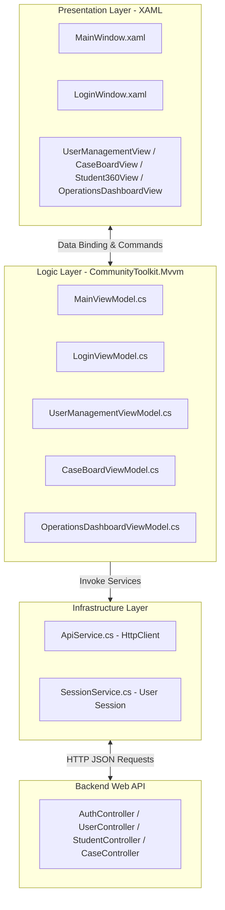

# TÀI LIỆU KIẾN TRÚC FRONTEND & LOGIC NGHIỆP VỤ (WPF CLIENT)

Tài liệu này trình bày chi tiết về kiến trúc kỹ thuật của ứng dụng Client chạy trên nền tảng **Windows Presentation Foundation (WPF)** sử dụng **.NET 10.0**, tích hợp mô hình **MVVM**, các dịch vụ kết nối mạng, cơ chế phân quyền hiển thị và luồng nghiệp vụ phía Client của Đồ án Nhóm 13.

---

## 🛠️ 1. Tổng Quan Kiến Trúc & Công Nghệ
Màn hình Client tương tác trực tiếp với người dùng và kết nối với Backend thông qua các RESTful API. Hệ thống tuân thủ mô hình thiết kế **MVVM (Model-View-ViewModel)** giúp tách biệt hoàn toàn giao diện (UI) và logic nghiệp vụ.



---

## 📂 2. Cấu Trúc Thư Mục Dự Án `QldtSdh.Wpf`

```text
QldtSdh.Wpf/
│
├── App.xaml & App.xaml.cs          # Điểm khởi chạy hệ thống, Đăng ký Dependency Injection (DI)
├── MainWindow.xaml & MainWindow.cs # Cửa sổ làm việc chính (Sidebar navigation, Quản lý View con)
├── LoginWindow.xaml & LoginWindow.cs # Cửa sổ đăng nhập hệ thống (Xuất hiện đầu tiên)
│
├── Converters/                     # Chuyển đổi dữ liệu hiển thị trên XAML
│   └── UserManagementConverters.cs  # Convert Status/RoleCode sang Color, Text hoặc Visibility
│
├── Services/                       # Tầng giao tiếp hạ tầng và dữ liệu
│   ├── ApiService.cs               # Gửi nhận HTTP (Get, Post, Put), tự động thêm Token & Header
│   └── SessionService.cs           # Quản lý trạng thái đăng nhập, thông tin người dùng và JWT
│
├── ViewModels/                     # Chứa logic xử lý nghiệp vụ, trạng thái hiển thị
│   ├── MainViewModel.cs            # Quản lý điều hướng Sidebar, ẩn hiện menu theo Quyền hạn
│   ├── LoginViewModel.cs           # Xử lý đăng nhập, bắt lỗi hệ thống và lưu session
│   ├── UserManagementViewModel.cs  # Xử lý danh sách cán bộ, Thêm mới, Khóa/Mở khóa, Reset Pass (chỉ Admin)
│   ├── CaseBoardViewModel.cs       # Quản lý sự vụ, Gán cán bộ, Chuyển trạng thái Workflow, Thêm ghi chú
│   ├── GlobalSearchViewModel.cs    # Tìm kiếm học viên, Lọc theo CTĐT/Trạng thái học vụ
│   ├── OperationsDashboardViewModel.cs # Dashboard điều hành, Drill-down KPI, Xuất CSV, Lưu Snapshot
│   └── Student360ViewModel.cs      # Hồ sơ 360 độ (Thông tin cá nhân, Học tập, Học phí, Luận văn, Văn bằng, Sự vụ)
│
├── Views/                          # Các UserControl giao diện
│   ├── CaseBoardView.xaml          # Bảng điều khiển quản lý sự vụ
│   ├── GlobalSearchView.xaml       # Màn hình tra cứu học viên
│   ├── OperationsDashboardView.xaml # Màn hình Dashboard chỉ số
│   ├── SnapshotHistoryView.xaml    # Xem lịch sử Snapshot báo cáo học kỳ
│   ├── Student360View.xaml         # Màn hình Hồ sơ 360 độ học viên
│   └── UserManagementView.xaml     # Màn hình Quản lý người dùng (Dành cho Quản trị viên)
│
└── appsettings.json                # Cấu hình địa chỉ Backend API (BaseAddress)
```

---

## 🔑 3. Luồng Logic Nghiệp Vụ Cốt Lõi Phía Client

### 3.1. Luồng Xác Thực & Quản Lý Phiên Làm Việc (Session)
1. **Khởi chạy ứng dụng**:
   * `App.xaml.cs` khởi tạo container Dependency Injection (DI) chứa `HttpClient`, `SessionService`, `ApiService` và các `ViewModels`.
   * `App.xaml.cs` mở `LoginWindow` đầu tiên thay vì `MainWindow`.
2. **Đăng nhập**:
   * Người dùng nhập tên đăng nhập và mật khẩu. `LoginViewModel.LoginAsync(password)` được gọi.
   * Gửi yêu cầu HTTP POST tới `auth/login` (thông qua `ApiService.PostAsync`).
   * **Thành công**: API phản hồi chứa mã Token JWT, họ tên, vai trò. `LoginWindow` gọi `SessionService.SaveSession()` để lưu thông tin vào RAM, đóng màn hình đăng nhập và mở `MainWindow`.
   * **Thất bại**: Hiển thị thông tin lỗi chi tiết (lỗi mạng hoặc thông báo tài khoản sai/bị khóa từ Server).
3. **Đăng xuất**:
   * Khi người dùng click nút **Đăng xuất** ở Sidebar, `MainViewModel` gọi `SessionService.ClearSession()`.
   * Ứng dụng khởi tạo lại một `LoginWindow` mới, đóng `MainWindow` hiện tại để bảo mật thông tin.

### 3.2. Luồng Tự Động Đính Kèm JWT Token & Header An Toàn
Mọi request gửi đi tới Backend API thông qua [ApiService.cs](file:///c:/Users/DANGQUANGHOA/Desktop/Do-An-Dotnet/frontend/QldtSdh.Wpf/Services/ApiService.cs) đều được tự động cấu hình HTTP Header thông qua hàm `SetAuthHeaders()`:
* **Authorization Header**: Đính kèm mã JWT dưới dạng `Bearer <token>` lấy từ `SessionService`. Giúp vượt qua bộ lọc xác thực `[Authorize]` trên Server.
* **X-User-Name Header**: Gửi kèm tên đăng nhập của cán bộ hiện tại (`SessionService.Username`, ví dụ: `canboA`). Đảm bảo an toàn không lỗi font chữ (chỉ chứa các ký tự ASCII) và giúp Server ghi nhận nhật ký hoạt động chính xác vào bảng `SearchAudit` trên Database.

### 3.3. Phân Quyền Vai Trò & Điều Khiển Giao Diện (Role-based UI Control)
Hệ thống có 2 cấp độ vai trò của người dùng: **Quản trị viên (ADMIN)** và **Cán bộ đào tạo (STAFF)**.
* **Tại Sidebar điều hướng**:
  * `MainViewModel.cs` theo dõi sự kiện thay đổi phiên đăng nhập từ `SessionService.SessionChanged`.
  * Thuộc tính `IsAdminMenuVisible` tự động chuyển đổi thành `true` nếu vai trò là `ADMIN` và `false` nếu là `STAFF`.
  * Trên file [MainWindow.xaml](file:///c:/Users/DANGQUANGHOA/Desktop/Do-An-Dotnet/frontend/QldtSdh.Wpf/MainWindow.xaml), Menu Item **Quản lý người dùng** binding thuộc tính `Visibility` trực tiếp với `IsAdminMenuVisible` thông qua `BooleanToVisibilityConverter`.
  * **STAFF** đăng nhập sẽ hoàn toàn không nhìn thấy và không thể click vào menu Quản lý người dùng.
* **Tại Bảng Sự Vụ (Case Board)**:
  * Sự vụ chỉ cho phép cán bộ phụ trách xử lý (`Assignee`) hoặc `ADMIN` thay đổi trạng thái.
  * Khi mở Popup chi tiết sự vụ, giao diện dựa trên thông tin đăng nhập hiện tại để ẩn/hiện hoặc vô hiệu hóa các nút chức năng chuyển trạng thái (`Bắt đầu xử lý`, `Đóng sự vụ`), ngăn chặn click sai quyền hạn ngay từ giao diện người dùng.

### 3.4. Nghiệp Vụ Tương Tác Chỉ Số (Drill-down & Deep-linking)
* **Drill-down**: Trên Dashboard điều hành, khi click chọn một thẻ chỉ số (ví dụ: *Học viên nợ học phí*), ứng dụng gọi API lấy danh sách chi tiết của nhóm đối tượng đó và cập nhật trực tiếp vào bảng danh sách bên dưới.
* **Deep-linking**: Khi đang xem danh sách sự vụ quá hạn tại Dashboard, cán bộ có thể click **Xử lý Case**. Hệ thống sẽ tự động chuyển hướng màn hình sang **Quản Lý Sự Vụ**, đồng thời kích hoạt hiển thị trực tiếp bảng thông tin chi tiết của sự vụ đó để xử lý ngay lập tức, tiết kiệm thời gian điều hướng thủ công.

---

## 🎨 4. Thiết Kế Giao Diện & Trải Nghiệm Người Dùng (Aesthetics)
Ứng dụng sử dụng phong cách thiết kế **Rich Dark Mode** hiện đại và cao cấp:
* **Bảng màu (Color Palette)**:
  * Nền tối huyền bí: `#0B0F0D` (Chủ đạo).
  * Panel phụ & Thẻ thông tin: `#1A1D1A` (Grey Glassmorphism).
  * Màu chữ nổi bật: `#F8FAFC` (Chữ chính) và `#94A3B8` (Chữ phụ).
  * Màu điểm nhấn Emerald Green: `#27AE60` / `#2ECC71` mang phong cách tối giản, cao cấp.
* **Typography**: Sử dụng font chữ hiện đại, phân cấp kích thước tiêu đề rõ ràng, căn lề DataGrid hiển thị thông tin học vụ cân đối dễ đọc.
* **Micro-animations & Hover Effects**: Các nút bấm, thẻ chỉ số KPI và các dòng trong danh sách đều tích hợp hiệu ứng chuyển đổi mượt mà (smooth transitions) khi di chuột qua, tạo cảm giác hệ thống luôn phản hồi và sinh động.
